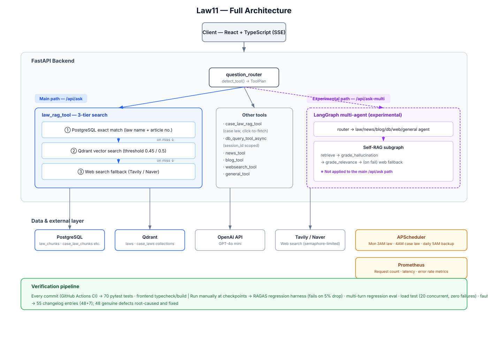

# Law11 — Korean Occupational Safety Law RAG Chatbot

> English summary. The [Korean README](README.md) is the primary document, including the full engineering changelog (46 documented find-fix cycles, plus 7 fixes that predate the changelog).

[](https://github.com/codingiswine/law11/actions/workflows/ci.yml)
[](https://www.python.org/)
[](https://fastapi.tiangolo.com/)
[]()

A domain-specialized RAG system over **9 Korean occupational-safety laws (1,629 articles)**. Built on a chatbot from a startup internship the year before, then rebuilt as an independent personal project — alongside an IT-academy internship — with a measurement-first engineering process.

Pipeline: **PostgreSQL exact-match → Qdrant semantic search → GPT-4o-mini**, with SSE streaming, multi-turn sessions, citation tracking, and an experimental LangGraph Self-RAG path (`/api/ask-multi`).

A separate case-law tool runs the same retrieval chain over its own collection (**52 Supreme Court precedents across 6 of those laws**). It is deliberately click-to-fetch rather than mixed into every answer, so a law question does not pay for a second LLM call it did not ask for.

## Verified quality metrics

All numbers are reproducible from the eval scripts in this repo (30-case corrected golden set, re-measured 2026-09-05):

| Metric | Value |
|---|---|
| Retrieval Top-3 recall | **96.7%** (30-case golden set; multi-accepted-article policy #30, statutory-term query expansion #33) |
| RAGAS Faithfulness / Answer Relevancy / Context Precision / Context Recall | **0.74 / 0.57 / 1.00 / 0.92** (gpt-4o-mini judge, re-measured 2026-09-05 after fixing RAGAS's own Korean-encoding bug, #40) |
| Hallucination (30-case golden set) | **0/30 outright fabrications** · 28/30 GROUNDED (93.3%; the other 2 are PARTIAL — imprecise phrasing, not false claims) · 0 citation misses — the judge's own false flags were fixed in #46, with detection power re-verified against 4 fabricated answers. **Scoped to the 9 laws in the DB; it does not cover out-of-scope questions that fall through to web search** |
| Router accuracy | **43/43 (100%)** (keyword fast-path + LLM hybrid, incl. 11 case-law routing cases) |
| Multi-turn regression evals | 5 scenarios, each **mutation-tested** (fix reverted → eval must fail) |
| Automated tests / CI | 68 pytest cases + GitHub Actions (backend tests, frontend typecheck/build) |
| Load test | 20 concurrent users, zero failures (2× the design target) |
| Fault injection | 5 dependencies (PG, Qdrant, OpenAI, Tavily, Naver) killed individually — 4 defects found and fixed (#31) |
| Documented find-fix cycles | 46 changelog entries (symptom → root cause → measured verification), plus 7 fixes that predate the changelog |

## Engineering highlights

The changelog documents 46 find-fix cycles in "symptom → root cause → measured verification" form. Selected findings:

- **The golden dataset was lying.** Retrieval eval showed 46.7% Top-3 recall; cross-checking failures against the DB revealed the *retrieval was right and the answer key was wrong* — 13/30 golden article numbers pointed at unrelated articles (e.g., "electric shock prevention" labeled as Article 132, which is about cranes). Correcting the labels moved recall to 83.3% and RAGAS Faithfulness from 0.44 to 0.74. (#25)
- **193 articles were silently lost to a normalization collision.** Korean laws have branch articles (제14조**의2**, "Article 14-2"); the ingest pipeline collapsed them into the same key as their base article, and the upsert's `ON CONFLICT DO UPDATE` overwrote whichever came first — entire articles (including the one defining the national disaster response HQ) vanished without any error. On the query side the same normalization turned "제14조의2" into "142", matching Article 142. Fixed the scheme end-to-end and resynced: 1,436 → 1,629 articles, RAGAS Faithfulness 0.74 → 0.86. (#28)
- **The reranker was destroying retrieval.** An A/B/C experiment showed the English-only cross-encoder (`ms-marco-MiniLM`) reordered Korean articles near-randomly, crushing Top-1 accuracy from 66.7% to 13.3%. A multilingual CE also failed to beat plain vector order, so reranking was removed entirely — a net-negative flagship feature, deleted on evidence. (#25)
- **Evals are themselves verified.** Every multi-turn regression scenario was validated by reverting the fix it enshrines and confirming the eval fails (mutation testing). This process caught an eval that silently passed because a Docker container — not the code under test — was serving the traffic, and another that polluted its own fixtures through the chat-history table. (#20, #21)
- **Killing dependencies on purpose surfaced a hallucination path that only exists in production incidents.** With every web-search backend (Tavily, Naver) deliberately taken down, the fallback still asked GPT to "summarize the search results" — with zero results. It answered anyway, inventing a specific numeric safety standard and presenting it as legal fact. Fixed by aborting generation when the search context is empty instead of letting the model fill the gap. Also found in the same sweep: a PostgreSQL outage was reported to the user as "this article doesn't exist," misrepresenting an infrastructure failure as a data-absence fact. (#31)
- **The "10 concurrent users" assumption was load-tested for the first time** after being carried untested from the predecessor project — validated at 20 users with zero failures.
- **Laws stay current automatically**: a weekly APScheduler job syncs PostgreSQL and Qdrant from the Korean Ministry of Government Legislation (DRF) API, now with post-sync consistency checks and stale-article cleanup so law changes/repeals don't linger as silent drift. (#32)

## Fixes that predate the changelog

The numbered changelog (#1–#46) starts at `v1.0.1` (2026-07-16), when the
"symptom → root cause → measured verification" format was adopted. Earlier bug fixes
exist only as commits; a later audit (`docs/defect_audit.md`) recovered them. They are
listed separately so the existing numbering stays stable.

| Commit | Date | Fix |
|---|---|---|
| [`2c8097e`](https://github.com/codingiswine/law11/commit/2c8097e) | 2026-07-05 | Paragraph/item numbers duplicated inside article text; citation badge order disagreed with the score shown on it |
| [`764b646`](https://github.com/codingiswine/law11/commit/764b646) | 2026-07-10 | Stream-completion race — a previous question's completion could fire on the next one, or a received answer could be dropped entirely; `confidence_score` read the pre-dedup top hit |
| [`ffdcb2f`](https://github.com/codingiswine/law11/commit/ffdcb2f) | 2026-07-11 | Web-fallback citations carried `score: 0.0`, rendered as a "0%" relevance badge — a false signal for "no score" |
| [`a5a5ea1`](https://github.com/codingiswine/law11/commit/a5a5ea1) | 2026-07-11 | Side panel showed a blank article-number header (the `article_number` column was NULL for every row until #28) and ran paragraph numbers into the text |
| [`2240ee5`](https://github.com/codingiswine/law11/commit/2240ee5) | 2026-07-12 | Sidebar history was always empty — the frontend sent a leftover `user_id` from the predecessor project while the backend saved another; `/api/history` also never returned `session_id` |
| [`893e0e2`](https://github.com/codingiswine/law11/commit/893e0e2) | 2026-07-12 | Redeploys did not reach users: `nginx.conf` was never copied into the image, so browsers kept a cached `index.html` pointing at old hashed bundles |
| [`9d9c230`](https://github.com/codingiswine/law11/commit/9d9c230) | 2026-08-31 | PostgreSQL (5432) and Qdrant (6333/6334) were published on `0.0.0.0` — harmless locally, but on EC2 the security group becomes the only line of defense. Rebound to `127.0.0.1` |

See the [Korean README](README.md#pre-changelog-수정-이력) for the full write-up of each.

## Architecture

<div align="center">
  
</div>

```
POST /api/ask
  → question_router  (keyword fast-path → LLM classification, session-aware)
  → tool             (law RAG / web search / news / DB history / small talk)
  → SSE stream       (text · status · source chunks + citation tracking)

law_rag_tool retrieval order:
  ① PostgreSQL exact match (law name + article number)
  ② Qdrant semantic search (text-embedding-3-large, 3072-dim, cosine top-5)
  ③ Web-search fallback (statute-style citation formatting, context-aware)
```

## Evaluation pipeline

| Command | What it measures |
|---|---|
| `python -m eval.harness` | RAGAS 4 metrics over the 30-case golden set, with regression compare (>5% drop → exit 1) |
| `python -m eval.eval_retrieval` | Retrieval Top-1/Top-3 accuracy (embedding-only, free) |
| `python -m eval.eval_router` | Router accuracy on 43 labeled cases |
| `python -m eval.eval_hallucination` | LLM-judge groundedness + citation verification |
| `python -m eval.eval_multiturn` | Multi-turn regression scenarios via the live API (mutation-tested) |

## Stack

FastAPI · PostgreSQL (asyncpg) · Qdrant · OpenAI (gpt-4o-mini, text-embedding-3-large) · LangGraph (experimental Self-RAG) · React 19 · Docker Compose · GitHub Actions

## Quick start

```bash
cp law11_backend/.env.example law11_backend/.env   # set OPENAI_API_KEY, DB_PASS
docker compose up --build                           # backend :8000, frontend :3000
docker compose exec fastapi python -m app.tools.law_updater_async --all   # load laws
```

See the [Korean README](README.md) for full architecture details, the complete changelog, API reference, and troubleshooting.
