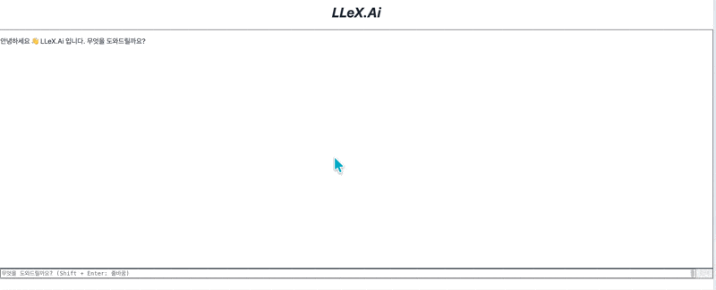

# Law11 — 산업안전보건 법령 RAG 챗봇

[](https://www.python.org/)
[](https://fastapi.tiangolo.com/)
[](https://reactjs.org/)
[](https://qdrant.tech/)
[](LICENSE)
[]()

한국 산업안전보건 법령 9개 (1,675개 조문)를 대상으로 한 **도메인 특화 RAG 시스템**입니다.  
PostgreSQL 정확 매칭 → Qdrant 의미 검색 (Cross-Encoder Reranking) → GPT-4o-mini 요약의 파이프라인으로 구성되며,  
Self-RAG 할루시네이션 검증, 멀티턴 세션, Citation 추적, SSE 기반 실시간 스트리밍을 지원합니다.

<div align="center">
  
</div>

---

## 목차

- [프로젝트 개요](#프로젝트-개요)
- [시스템 아키텍처](#시스템-아키텍처)
- [RAG 파이프라인 상세](#rag-파이프라인-상세)
- [평가 파이프라인](#평가-파이프라인)
- [운영 모니터링](#운영-모니터링)
- [기술 스택](#기술-스택)
- [빠른 시작](#빠른-시작)
- [데이터 현황](#데이터-현황)
- [API 레퍼런스](#api-레퍼런스)
- [개발 환경](#개발-환경)

---

## 프로젝트 개요

### 배경

이전 직장에서 서울시 자치구 대상 법령 검토 비효율 문제를 해결하기 위해 PoC로 시작했습니다. 퇴사 후 개인 프로젝트로 독립해 RAG 파이프라인을 전면 재설계(question_router 재작성, embedding_cache·reranker·self_rag_subgraph 신규 구현)하고, Cross-Encoder Reranking·Self-RAG 할루시네이션 검증·Citation 추적·답변 품질 점수를 새로 추가했습니다. 평가 파이프라인에도 할루시네이션·Citation 검증을 확장 적용했습니다.

산업안전보건 실무자들은 9개 법령에 걸쳐 있는 수천 개 조문 중 관련 규정을 빠르게 찾아야 합니다. 기존 법제처 검색은 키워드 일치에 의존해 "안전관리자 선임 기준이 뭔가요?" 같은 자연어 질문에 답하기 어렵습니다.

Law11은 이 도메인에 특화된 RAG 시스템으로, **정확한 조문 번호를 모르는 상황**에서도 의미론적으로 가장 관련 있는 조문을 찾아 GPT가 실무 중심으로 해설합니다.

### 핵심 수치

| 항목 | 수치 |
|---|---|
| 수록 법령 | 9개 |
| 조문 수 | 1,675개 |
| 임베딩 모델 | `text-embedding-3-large` (3,072차원) |
| Reranker 모델 | `cross-encoder/ms-marco-MiniLM-L-6-v2` |
| 평균 응답 시간 | < 3초 (스트리밍 첫 토큰 기준) |
| 동시 접속 설계 목표 | 10명 (Connection pool 튜닝) |

---

## 시스템 아키텍처

```
사용자 질문
    │
    ▼
┌─────────────────────────────────────────────┐
│  Question Router (LLM Hybrid)               │
│  DB 세션 컨텍스트 연동 · 외국 법령 자동 전환   │
│  키워드 fast-path → 애매한 질문은 LLM 분류    │
└─────────────┬───────────────────────────────┘
              │ ToolPlan (tool + args + context)
              ▼
┌─────────────────────────────────────────────────────────────┐
│  Tool 선택 (tool_map)                                        │
│                                                             │
│  law_rag_tool     — 국내 법령 RAG (기본 경로)                │
│  news_tool        — 산업안전 관련 뉴스 검색                   │
│  blog_tool        — 블로그 콘텐츠 검색                       │
│  websearch_tool   — 외국 법령 / 일반 웹 검색                  │
│  db_query_tool    — DB 직접 조회 (통계/이력)                  │
│  general_tool     — 일반 대화 / 법령 외 질문                  │
└─────────────┬───────────────────────────────────────────────┘
              │ (law_rag_tool 경로)
              ▼
┌─────────────────────────────────────────────┐
│  Law RAG Tool (law_rag_tool.py)             │
│                                             │
│  ① PostgreSQL 정확 매칭                     │
│     WHERE law_name_norm = ?                 │
│           AND article_number_norm = ?       │
│     ↓ (miss)                                │
│  ② Qdrant 의미 검색 (limit=10)              │
│     + Cross-Encoder Reranking → top 5       │
│     threshold=0.45/0.5                      │
│     ↓ (miss)                                │
│  ③ Web Search Fallback                     │
│                                             │
└─────────────┬───────────────────────────────┘
              │ 조문 텍스트 + citations
              ▼
┌─────────────────────────────────────────────┐
│  Self-RAG 검증 (self_rag_subgraph.py)        │
│  ① 할루시네이션 판정 (grade_hallucination)   │
│  ② 관련성 판정 (grade_relevance)            │
│  ③ 재시도 최대 2회 → websearch fallback      │
└─────────────┬───────────────────────────────┘
              │
              ▼
┌─────────────────────────────────────────────┐
│  GPT-4o-mini 스트리밍 요약                   │
│  temperature=0.2, stream=True               │
└─────────────┬───────────────────────────────┘
              │ SSE (text/event-stream)
              │
              ├──→ QA Logger (JSONL)          ← retrieval 메타데이터
              ├──→ Citations 테이블 저장       ← 인용 조문 + 신뢰도 점수
              └──→ React 프론트엔드 (3패널 레이아웃)
                   ├── 좌측 사이드바 (대화 히스토리)
                   ├── 법령 칩 (score 배지, 웹 fallback 인용 포함)
                   └── 우측 LawSidePanel (조문 원문 / 법령정보원 링크)
```

### 서비스 구성 (Docker Compose)

| 서비스 | 이미지 | 포트 | 역할 |
|---|---|---|---|
| `fastapi` | custom build | 8000 | FastAPI 백엔드 |
| `frontend` | Nginx Alpine | 3000 | React 정적 서빙 |
| `postgres` | postgres:15 | 5432 | 조문 원문 + 대화 이력 + Citations |
| `qdrant` | qdrant/qdrant | 6333 | 벡터 유사도 검색 |

### 주요 파일 구조

| 파일 | 역할 |
|---|---|
| `core/plan.py` — `ToolPlan` | 라우터 출력: `tool` 이름 + `args` 딕셔너리 |
| `core/stream.py` — `ToolChunk` | 스트리밍 단위: `type` ∈ `{status,text,source,meta,error}` |
| `app/services/question_router.py` | LLM Hybrid 툴 선택 (키워드 fast-path + LLM fallback + DB 세션 컨텍스트) |
| `app/services/embedding_cache.py` | SQLite 기반 임베딩 캐시 (SHA-256 키) |
| `app/services/reranker.py` | Cross-Encoder lazy 싱글톤, `rerank(query, docs, top_k)` |
| `app/services/rag_grader.py` | 할루시네이션/관련성 판정 함수 |
| `app/services/self_rag_subgraph.py` | LangGraph Self-RAG 서브그래프 (4노드 + 2 conditional edge) |
| `app/services/langgraph_multi_agent.py` | LangGraph StateGraph 멀티 에이전트 (`/api/ask-multi`). 팩토리 함수(`_make_tool_node`)로 5개 tool 노드 생성, 그래프는 모듈 로드 시 1회 컴파일 후 싱글턴 재사용 |
| `app/services/rag_service.py` | eval용 Qdrant 검색 래퍼 + `get_embedding_async` re-export |
| `app/services/law_scheduler.py` | APScheduler 기반 주간 법령 자동 업데이트 |
| `app/services/qa_logger.py` | Retrieval 메타데이터 JSONL 로깅 |
| `app/services/metrics_service.py` | Prometheus 메트릭 수집 |
| `app/api/routes.py` | SSE 엔드포인트, 세션 관리, Citation 저장, 품질 점수 |
| `app/config/settings.py` | Pydantic-settings, 비동기 클라이언트 싱글턴 |
| `app/tools/law_rag_tool.py` | 3단 검색 + Reranking + Citation 이벤트 + 웹 fallback 인용 추출 |
| `app/tools/law_updater_async.py` | 법제처 DRF API → PG + Qdrant 동기화 (비동기) |

---

## RAG 파이프라인 상세

### 검색 계층 설계

단순 벡터 검색만으로는 "산업안전보건법 제17조"처럼 정확한 조문을 지정한 질문에서 노이즈가 생깁니다. 반대로 PostgreSQL 정확 매칭만 쓰면 "안전관리자 선임 기준은?" 같은 개념형 질문에서 조문 번호를 알 수 없어 검색이 실패합니다. 두 방식을 계층화해 각 쿼리 유형에 최적의 경로를 사용합니다.

```
질문 유형          경로                                  특징
────────────────────────────────────────────────────────────────
직접 조문 조회   PostgreSQL 정확 매칭 (1ms)              법령명 + 조문번호 인덱스
개념형 질문      Qdrant top-10 → Cross-Encoder top-5     코사인 유사도 + 재순위
외국/국제 법령   Web Search 즉시 분기                    OSHA, ISO 등 키워드 감지
법령 외 질문     Web Search Fallback                     일반 웹 검색
```

### Cross-Encoder Reranking

Qdrant에서 후보 10개를 가져온 뒤 `cross-encoder/ms-marco-MiniLM-L-6-v2`로 재순위해 상위 5개만 GPT에 전달합니다. Bi-encoder(임베딩) 대비 쿼리-문서 쌍 교차 주의(cross-attention)로 정밀도가 향상됩니다.

```python
# app/services/reranker.py
def rerank(query: str, documents: List[str], top_k: int = 5) -> List[int]:
    scores = model.predict([(query, doc) for doc in documents])
    return sorted(range(len(scores)), key=lambda i: scores[i], reverse=True)[:top_k]
```

### 임베딩 캐시

동일한 질문의 반복 임베딩 생성을 방지하기 위해 SQLite 기반 로컬 캐시를 구현했습니다 (`embedding_cache.py`). 캐시 히트 시 OpenAI API 호출 없이 즉시 반환합니다.

```python
# 캐시 키: SHA-256(query text)
# 저장: .cache/embedding_cache.db (SQLite)
```

### Self-RAG 할루시네이션 검증

법령 RAG 경로의 답변은 `self_rag_subgraph.py`의 LangGraph 서브그래프를 거쳐 품질을 검증합니다.

```
retrieve() → grade_hallucination() → grade_relevance()
                  ↓ HALLUCINATION           ↓ NOT_RELEVANT
              재시도 (최대 2회)          websearch_fallback()
```

- **GROUNDED**: 답변의 모든 주장이 조문에서 확인 가능 → 그대로 반환
- **PARTIAL/HALLUCINATION**: 재시도 또는 웹 검색 fallback
- **NOT_RELEVANT**: 검색 결과가 질문과 무관 → 웹 검색 fallback

### 멀티턴 세션

프론트엔드가 `session_id`(UUID)를 생성해 매 요청에 포함합니다. 백엔드는 `chat_history` 테이블에서 최근 5개 교환 쌍을 읽어 LLM 프롬프트 앞에 삽입합니다.

```python
# app/services/question_router.py
async def _load_session_context(session_id: str, limit: int = 5) -> str:
    """DB에서 최근 N 교환 쌍을 '사용자: ...\nLaw11: ...' 형식으로 반환"""
```

### Citation 추적

법령 RAG 경로에서 GPT에 전달한 조문의 메타데이터(law_name, article_number, score, rank)를 `citations` 테이블에 저장하고 SSE `source` 이벤트로 클라이언트에 전송합니다. 프론트엔드는 신뢰도 점수 배지가 있는 법령 칩으로 표시합니다.

### 답변 품질 점수

응답이 DB에 저장될 때 자동으로 품질 점수를 산출합니다. 법령명 참조(`「...」`)와 조문 번호(`제N조`) 출현 횟수를 기반으로 0–100점을 계산하며, `chat_history.score` 컬럼에 저장됩니다.

---

## 평가 파이프라인

RAG 시스템의 품질을 정량적으로 측정하기 위해 [RAGAS](https://docs.ragas.io/) 기반 오프라인 평가 파이프라인을 구축했습니다.

### 평가 구조

```
law11_backend/eval/
├── harness.py               # 통합 진입점: 베이스라인 + 회귀 + smoke
├── seed_golden_dataset.py   # DB 조문 → 골든셋 초안 자동 생성
├── golden_dataset.json      # 30개 테스트 케이스 (수동 검수)
├── retriever.py             # 평가용 RAG 래퍼 (non-streaming)
├── run_eval.py              # RAGAS 메트릭 계산 및 결과 저장
├── eval_router.py           # 라우터 정확도 평가
├── eval_retrieval.py        # 검색 성능 (top-k) 평가
├── eval_hallucination.py    # 할루시네이션 + Citation 검증
├── collect_failures.py      # 실패 케이스 수집·분류
├── improvement_loop.py      # 반복 개선 루프
├── perf_report.py           # 운영 로그 기반 성능 보고서
├── logs/                    # qa_YYYYMMDD.jsonl (요청별 메타데이터)
├── failures/                # 실패 케이스 분류 결과
└── results/                 # 평가 결과 JSON (--compare 기준점)
```

### 측정 메트릭 (RAGAS 4종)

| 메트릭 | 측정 내용 | 의미 |
|---|---|---|
| **Faithfulness** | 답변이 검색된 조문에만 근거하는지 | 할루시네이션 탐지 |
| **Answer Relevancy** | 답변이 질문에 실제로 답하는지 | 응답 품질 |
| **Context Precision** | 검색된 조문 중 실제로 관련된 비율 | 검색 정밀도 |
| **Context Recall** | 정답에 필요한 조문이 검색됐는지 | 검색 재현율 |

### 골든 데이터셋 구성 (30개)

| 질문 유형 | 수량 | 예시 |
|---|---|---|
| 직접 조문 조회 | 8개 | "산업안전보건법 제17조 내용은?" |
| 개념형 질문 | 9개 | "안전관리자 선임 기준은?" |
| 처벌/패널티 | 6개 | "중대재해 경영책임자 처벌 수위는?" |
| 기준/설치 | 7개 | "비계 설치 안전 기준은?" |

### 평가 실행

```bash
cd law11_backend && source ../.venv/bin/activate

# 전체 평가 (30케이스) + 직전 결과와 자동 비교
python -m eval.harness

# 빠른 확인 (5케이스 smoke)
python -m eval.harness --smoke

# 회귀 테스트 (5% 이상 하락 시 exit 1)
python -m eval.harness --compare

# 라우터 정확도
python -m eval.eval_router

# 검색 성능 (top-k 비교)
python -m eval.eval_retrieval

# 할루시네이션 + Citation 검증
python -m eval.eval_hallucination
```

---

## 발견 및 수정한 문제들

시스템을 분석하면서 발견한 버그들을 진단하고 수정했습니다.

### 1. Qdrant payload 필드명 불일치

**문제**: `rag_service.py`의 `build_context()`가 실제 Qdrant에 저장된 필드명과 다른 이름을 사용해 context가 항상 빈 문자열로 구성됐습니다.

```python
# 수정 전 — Qdrant payload에 존재하지 않는 한국어 키
law_name = payload.get("법령명", "")   # → 항상 ""
content  = payload.get("본문", "")    # → 항상 ""

# 수정 후 — law_updater_async.py가 실제 저장하는 키
law_name = payload.get("law_name", "")
content  = payload.get("text", "")
```

**영향**: Qdrant 벡터 검색 경로에서 GPT가 빈 context로 답변을 생성하고 있었음.

---

### 2. Qdrant 필터가 개념형 쿼리 검색을 차단

**문제**: PostgreSQL 정확 매칭 실패 후 Qdrant 검색에서 `article_number_norm` 필터를 `must` 조건으로 걸었습니다. 조문 번호가 없는 개념형 질문은 `article_number_norm=""` 필터가 적용돼 항상 결과 0건 → web fallback으로 빠졌습니다.

```python
# 수정 전 — 조문 번호 모르면 검색 불가
q_filter = Filter(must=[
    FieldCondition(key="law_name_norm", ...),
    FieldCondition(key="article_number_norm", ...),  # ← 차단 원인
])
results = await qdrant.search(..., limit=1)  # 후보도 1개뿐

# 수정 후 — 법령 내 의미론적 검색
q_filter = Filter(must=[
    FieldCondition(key="law_name_norm", ...),  # 법령 범위만 제한
])
results = await qdrant.search(..., limit=10, threshold=0.45)
```

**영향**: "안전관리자 선임 기준은?"처럼 법령명은 명시하지만 조문 번호를 모르는 실무 질문의 검색 성공률 대폭 향상.

---

### 3. context 길이 제한이 조문 내용을 잘라냄

**문제**: `build_context()`의 `max_chunk_length=150`으로 대부분의 조문이 중간에 잘렸습니다.

```python
# 수정 전: 150자 → 평균 조문 길이의 20%도 안 포함됨
# 수정 후: 500자 → 핵심 내용 포함 가능
max_chunk_length: int = 500
```

---

### 4. 벡터 검색 후보 부족 + Reranking 부재

**문제**: Qdrant top-5만 GPT에 전달하면 bi-encoder 특성상 의미적으로 유사하지만 실제 관련도가 낮은 조문이 포함될 수 있습니다.

```python
# 수정 전: top-5를 그대로 GPT에 전달
results = await qdrant.search(..., limit=5)

# 수정 후: top-10 후보에서 Cross-Encoder로 재순위 → top-5만 전달
results = await qdrant.search(..., limit=10)
ranked_indices = reranker.rerank(query, docs, top_k=5)
results = [results[i] for i in ranked_indices]
```

**영향**: GPT에 전달되는 조문의 관련도 향상, 할루시네이션 감소.

---

### 5. 건설 안전 키워드 웹 fallback 오류

**문제**: "비계 설치 안전 기준", "크레인 작업 기준" 등 건설 현장 용어가 `_CONDITION_LAW_MAP`에 없어서 전체 컬렉션 벡터 검색 후 threshold 미달 → web fallback으로 빠졌습니다. 실제 조문은 산업안전보건기준에관한규칙(674개 조문)에 있었습니다.

```python
# 수정 후 — 건설 안전 키워드 → 기준에관한규칙 우선 검색
({"비계", "거푸집", "동바리", "족장", "가시설"}, "산업안전보건기준에관한규칙"),
({"굴착", "발파", "터널", "흙막이", "사면"},     "산업안전보건기준에관한규칙"),
({"크레인", "리프트", "달비계", "곤돌라", "양중"}, "산업안전보건기준에관한규칙"),
({"밀폐공간", "산소결핍", "유해가스", "환기"},    "산업안전보건기준에관한규칙"),
```

**영향**: 건설 현장 관련 질문의 법령 DB 히트율 대폭 향상.

---

### 6. LangGraph 그래프 매 요청마다 재컴파일

**문제**: `run_multi_agent()`가 호출될 때마다 `create_multi_agent_graph()`를 내부에서 실행해, LangGraph `StateGraph.compile()`이 매 요청마다 반복됐습니다.

```python
# 수정 전 — 요청마다 그래프 재생성
async def run_multi_agent(user_id: str, question: str):
    graph = create_multi_agent_graph()   # ← 매 요청마다 compile()
    final_state = await graph.ainvoke(...)

# 수정 후 — 모듈 로드 시 1회만 컴파일, 이후 재사용
_graph = _build_graph()   # 모듈 임포트 시 1회 실행

async def run_multi_agent(user_id: str, question: str):
    final_state = await _graph.ainvoke(...)   # 컴파일된 그래프 재사용
```

**영향**: `/api/ask-multi` 엔드포인트의 첫 토큰 지연 시간 감소. 동시 요청 시 중복 컴파일로 인한 CPU 스파이크 제거.

---

## 운영 모니터링

### 법령 자동 업데이트 스케줄러

`law_scheduler.py`가 FastAPI lifespan에 등록되어 **매주 월요일 새벽 3시(KST)** 법제처 DRF API에서 최신 법령을 자동으로 가져와 PostgreSQL과 Qdrant를 동기화합니다.

```bash
# 수동 즉시 업데이트
docker compose exec fastapi python -m app.tools.law_updater_async --all
```

### QA 로그

요청마다 retrieval 메타데이터가 `eval/logs/qa_YYYYMMDD.jsonl`에 자동 기록됩니다.

```json
{
  "ts": "2026-06-21T12:00:00",
  "tool": "law_rag_tool",
  "query": "안전관리자 선임 기준은?",
  "query_type": "semantic",
  "selected_source": "qdrant",
  "selected_articles": ["산업안전보건법 제17조"],
  "fallback_used": false,
  "confidence_score": 0.5712
}
```

### Prometheus 메트릭

| 메트릭 | 설명 |
|---|---|
| `llex_requests_total` | 엔드포인트·agent별 요청 수 |
| `llex_response_time_seconds` | 응답 시간 히스토그램 |
| `llex_tokens_used_total` | 모델별 토큰 사용량 |
| `llex_errors_total` | 에러 유형별 카운터 |

```bash
curl http://localhost:8000/api/metrics          # Prometheus 원시 메트릭
curl http://localhost:8000/api/metrics/summary  # 요약
```

---

## 기술 스택

### Backend

| 기술 | 버전 | 용도 |
|---|---|---|
| FastAPI | 0.115 | 비동기 API 서버, SSE 스트리밍 |
| SQLAlchemy | 2.0 | 비동기 PostgreSQL ORM |
| asyncpg | 0.30 | PostgreSQL 비동기 드라이버 |
| Qdrant Client | 1.11 | 벡터 유사도 검색 |
| sentence-transformers | 5.x | Cross-Encoder Reranking |
| LangGraph | 0.2 | Self-RAG 서브그래프 + 멀티 에이전트 |
| LangChain | 0.3 | LLM 체인 유틸 |
| APScheduler | 3.x | 법령 자동 업데이트 스케줄러 |
| RAGAS | 0.1 | RAG 평가 파이프라인 |
| Prometheus Client | - | 운영 메트릭 수집 |

### Frontend

| 기술 | 버전 | 용도 |
|---|---|---|
| React | 19 | UI 컴포넌트 (3패널 레이아웃) |
| TypeScript | 5.9 | 타입 안전성 |
| Vite | 7.1 | 빌드 도구 |
| TailwindCSS | 4.1 | 스타일링 |

**UI 구조:** 좌측 다크 사이드바(대화 히스토리) + 중앙 채팅 + 우측 법령 패널(클릭 시 조문 원문 표시, DB 미등록 법령은 법령정보원 링크)

### Infrastructure

```
Docker Compose  │  Nginx Alpine (프론트엔드 서빙)
PostgreSQL 15   │  Qdrant (벡터 DB)
SQLite          │  임베딩 캐시 (.cache/embedding_cache.db)
```

---

## 빠른 시작

### 사전 요구사항

- Docker 20.10+, Docker Compose 2.0+
- OpenAI API 키

### 실행

```bash
git clone https://github.com/codingiswine/law11.git
cd law11

# 환경 변수 설정
cp law11_backend/env.example law11_backend/.env
# law11_backend/.env 편집: OPENAI_API_KEY, DB_PASS 입력

# 빌드 및 실행
docker compose up --build

# 법령 데이터 로드 (최초 1회, 별도 터미널)
docker compose exec fastapi python -m app.tools.law_updater_async --all
```

| 서비스 | URL |
|---|---|
| 프론트엔드 | http://localhost:3000 |
| API 문서 (Swagger) | http://localhost:8000/docs |
| 헬스 체크 | http://localhost:8000/health |

### 환경 변수

| 변수 | 필수 | 설명 |
|---|---|---|
| `OPENAI_API_KEY` | ✅ | OpenAI API 키 |
| `DB_PASS` | ✅ | PostgreSQL 비밀번호 |
| `LAW_OC_ID` | ✅ | 법제처 DRF API OC ID |
| `QDRANT_COLLECTION_NAME` | - | Qdrant 컬렉션명 (기본: `laws`) |
| `GOOGLE_SEARCH_API_KEY` | - | 웹 검색 (없으면 DuckDuckGo 사용) |

---

## 데이터 현황

### 수록 법령

| 법령명 | 조문 수 |
|---|---|
| 산업안전보건기준에 관한 규칙 | 690 |
| 산업안전보건법 시행규칙 | 250 |
| 산업안전보건법 | 184 |
| 재난 및 안전관리 기본법 시행령 | 199 |
| 재난 및 안전관리 기본법 | 156 |
| 산업안전보건법 시행령 | 124 |
| 재난 및 안전관리 기본법 시행규칙 | 43 |
| 중대재해 처벌 등에 관한 법률 | 16 |
| 중대재해 처벌 등에 관한 법률 시행령 | 13 |
| **합계** | **1,675** |

### 법령 자동 업데이트

법제처 DRF(Data Release Format) API를 통해 법령 개정 시 자동으로 PostgreSQL과 Qdrant를 동기화합니다. `law_scheduler.py`가 FastAPI lifespan에 등록되어 **매주 월요일 새벽 3시**에 자동 실행됩니다.

---

## API 레퍼런스

### `POST /api/ask` — 법령 질의 (SSE 스트리밍)

```bash
curl -X POST http://localhost:8000/api/ask \
  -H "Content-Type: application/json" \
  -d '{"question": "산업안전보건법 제17조 내용은?", "session_id": "uuid-here"}'
```

**SSE 응답 형식**:

```
data: {"event": "status", "payload": "⚖️ 법령 검색 시작..."}
data: {"event": "status", "payload": "✅ [Qdrant] 유사도 0.57 조문 발견"}
data: {"event": "text",   "payload": "산업안전보건법 제17조는..."}
data: {"event": "source", "payload": {"retrieved_laws": [{"law_name": "산업안전보건법", "article_number": "17", "score": 0.5712, "rank": 1}], "law_url": "https://..."}}
data: {"event": "saved",  "payload": "42"}
data: {"event": "status", "payload": "✅ 대화 저장 완료"}
```

| event 타입 | 내용 |
|---|---|
| `status` | 처리 단계 메시지 |
| `text` | 실제 답변 텍스트 (스트리밍) |
| `source` | 인용 조문 목록 (law_name, article_number, score, rank) |
| `saved` | 저장된 DB 레코드 ID |
| `warning` | 비치명적 경고 |
| `error` | 오류 메시지 |

### `GET /api/session/{session_id}` — 세션 대화 이력 조회

```bash
curl http://localhost:8000/api/session/my-session-uuid
```

### `DELETE /api/session/{session_id}` — 세션 삭제

```bash
curl -X DELETE http://localhost:8000/api/session/my-session-uuid
```

### `GET /api/law` — 특정 조문 직접 조회

```bash
curl "http://localhost:8000/api/law?name=산업안전보건법&article=17"
```

### `GET /api/history` — 전체 대화 이력 조회

```bash
curl "http://localhost:8000/api/history?limit=50&user_id=law11_user"
```

### `POST /api/feedback` — 사용자 피드백

```bash
curl -X POST http://localhost:8000/api/feedback \
  -H "Content-Type: application/json" \
  -d '{"message_id": 42, "value": 1}'
# value: 1 = 👍, -1 = 👎
```

### `GET /api/metrics` — Prometheus 메트릭

```bash
curl http://localhost:8000/api/metrics
curl http://localhost:8000/api/metrics/summary
```

---

## 개발 환경

### 백엔드 로컬 실행

```bash
# venv는 프로젝트 루트에 있음
source .venv/bin/activate
cd law11_backend
pip install -r requirements.txt
uvicorn app.main:app --host 0.0.0.0 --port 8000 --reload
```

### 프론트엔드 로컬 실행

```bash
cd law11_frontend
npm install
npm run dev   # http://localhost:5173
```

### 테스트 실행

```bash
source .venv/bin/activate
cd law11_backend && python -m pytest tests/ -v
```

### 유용한 Docker 명령어

```bash
# 백엔드 로그 실시간 확인
docker compose logs -f fastapi

# 백엔드만 재빌드
docker compose up -d --no-deps --build fastapi

# PostgreSQL 직접 접속
docker compose exec postgres psql -U daniel -d law11

# 법령 데이터 업데이트
docker compose exec fastapi python -m app.tools.law_updater_async --all
```

---

## 트러블슈팅

| 증상 | 원인 | 해결 |
|---|---|---|
| 벡터 검색 결과 없음 | Qdrant 데이터 미적재 | `law_updater_async --all` 실행 |
| `DB_PASS` 오류로 시작 실패 | `.env` 파일 누락 | `env.example` 복사 후 값 입력 |
| SSE 응답 끊김 | Nginx 프록시 버퍼링 | `proxy_buffering off` 설정 확인 |
| 임베딩 캐시 오류 | `.cache/` 권한 문제 | `chmod 777 .cache/` |
| uvicorn 명령어 없음 | pyenv venv 충돌 | `python -m uvicorn` 사용 |
| Cross-Encoder 느림 | CPU 추론 | 첫 요청 시 ~500ms 추가, 이후 정상 |

---

## 라이선스

MIT License © 2024 Daniel Shin

---

<div align="center">
  <p>개발자: 신다니엘 (Daniel Shin) · <a href="mailto:codingiswine@gmail.com">codingiswine@gmail.com</a> · <a href="https://github.com/codingiswine">@codingiswine</a></p>
</div>
