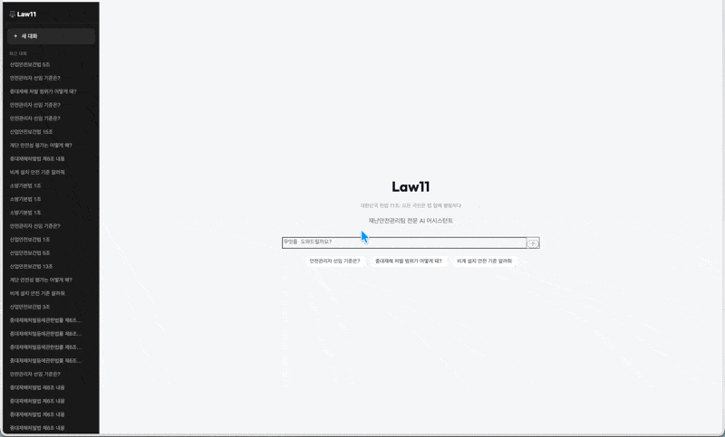
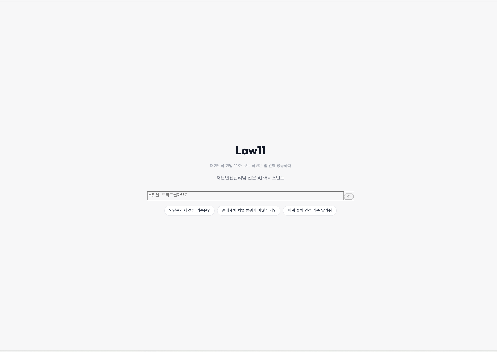
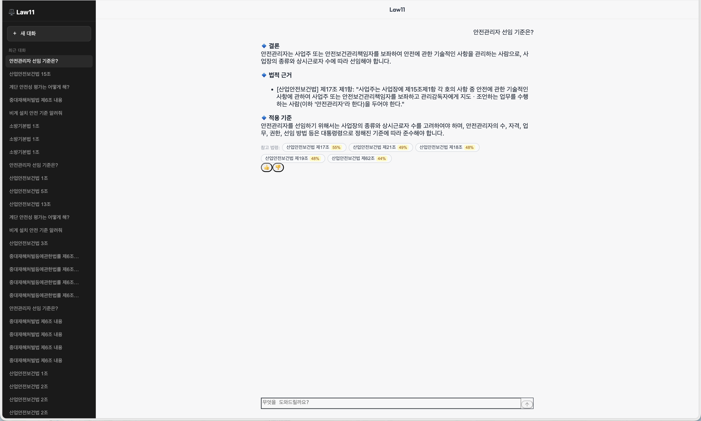
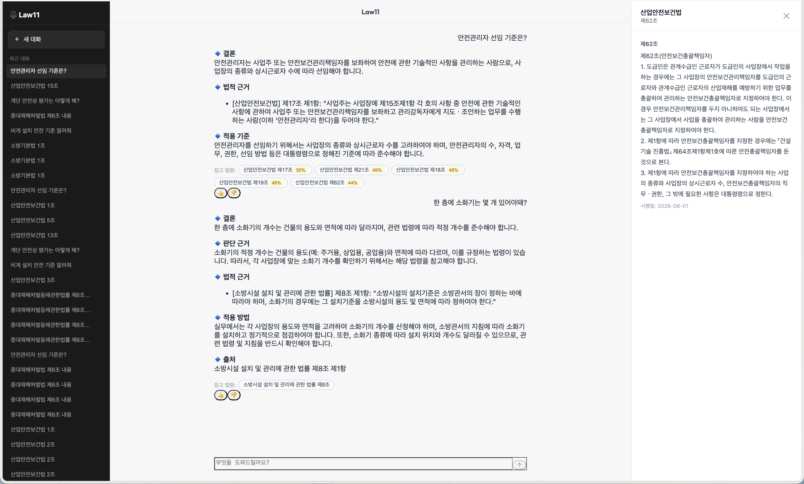
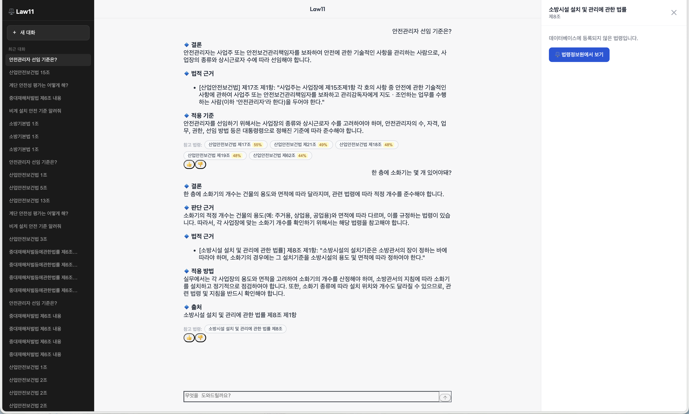

# Law11 — 산업안전보건 법령 RAG 챗봇

**한국어** | [English summary](README.en.md)

[](https://github.com/codingiswine/law11/actions/workflows/ci.yml)
[](https://www.python.org/)
[](https://fastapi.tiangolo.com/)
[](https://reactjs.org/)
[](https://qdrant.tech/)
[](LICENSE)
[]()

한국 산업안전보건 법령 9개 (1,436개 조문)를 대상으로 한 **도메인 특화 RAG 시스템**입니다.  
PostgreSQL 정확 매칭 → Qdrant 의미 검색 → GPT-4o-mini 요약의 파이프라인으로 구성되며,  
멀티턴 세션, Citation 추적, SSE 기반 실시간 스트리밍을 지원하며, `/api/ask-multi` 전용 실험적 Self-RAG 할루시네이션 검증 경로도 별도로 제공합니다.

<div align="center">
  
</div>

<table>
  <tr>
    <td></td>
    <td></td>
  </tr>
  <tr>
    <td></td>
    <td></td>
  </tr>
</table>

---

## 목차

- [프로젝트 개요](#프로젝트-개요)
- [시스템 아키텍처](#시스템-아키텍처)
- [RAG 파이프라인 상세](#rag-파이프라인-상세)
- [평가 파이프라인](#평가-파이프라인)
- [운영 모니터링](#운영-모니터링)
- [기술 스택](#기술-스택)
- [빠른 시작](#빠른-시작)
- [데이터 현황](#데이터-현황)
- [API 레퍼런스](#api-레퍼런스)
- [개발 환경](#개발-환경)

---

## 프로젝트 개요

### 배경

이전 직장에서 서울시 자치구 대상 법령 검토 비효율 문제를 해결하기 위해 PoC로 시작했습니다. 퇴사 후 개인 프로젝트로 독립해 RAG 파이프라인을 전면 재설계(question_router 재작성, embedding_cache·self_rag_subgraph 신규 구현)하고, Self-RAG 할루시네이션 검증·Citation 추적·답변 품질 점수를 새로 추가했습니다. Cross-Encoder Reranking도 도입했으나 이후 실측에서 유해함이 확인돼 제거했습니다(#25). 평가 파이프라인에도 할루시네이션·Citation 검증을 확장 적용했습니다.

산업안전보건 실무자들은 9개 법령에 걸쳐 있는 수천 개 조문 중 관련 규정을 빠르게 찾아야 합니다. 기존 법제처 검색은 키워드 일치에 의존해 "안전관리자 선임 기준이 뭔가요?" 같은 자연어 질문에 답하기 어렵습니다.

Law11은 이 도메인에 특화된 RAG 시스템으로, **정확한 조문 번호를 모르는 상황**에서도 의미론적으로 가장 관련 있는 조문을 찾아 GPT가 실무 중심으로 해설합니다.

### 핵심 수치

**검증 · 품질 지표** — 전부 리포지토리의 eval 스크립트로 재현 가능한 실측값입니다 (2026-07-18, 교정된 골든셋 기준):

| 지표 | 수치 |
|---|---|
| 검색 Top-3 recall | **83.3%** (골든셋 30케이스, `eval_retrieval`) |
| RAGAS Faithfulness / Context Recall | **0.74 / 0.93** (30케이스, gpt-4o-mini judge) |
| 할루시네이션 안전율 | **96.7%** (LLM-judge 30케이스 · Citation 누락 0건) |
| 라우터 정확도 | **32/32 (100%)** (키워드 fast-path + LLM 하이브리드) |
| 멀티턴 회귀 eval | 시나리오 5개 — 전부 **mutation test**(fix 되돌리기)로 회귀 감지력 검증 |
| 자동화 테스트 / CI | pytest 46개 + GitHub Actions (백엔드 pytest · 프론트 typecheck/build) |
| 동시 접속 부하테스트 | 20명 동시 요청 무실패 (설계 목표 10명의 2배) |
| 문서화된 발견-수정 사이클 | changelog 25건 (증상 → 근본 원인 → 실측 검증 형식) |

**시스템 개요**:

| 항목 | 수치 |
|---|---|
| 수록 법령 | 9개 (조문 1,436개) |
| 임베딩 모델 | `text-embedding-3-large` (3,072차원) |
| 평균 응답 시간 | < 3초 (스트리밍 첫 토큰 기준) |

---

## 시스템 아키텍처

```
사용자 질문
    │
    ▼
┌─────────────────────────────────────────────┐
│  Question Router (LLM Hybrid)               │
│  DB 세션 컨텍스트 연동 · 외국 법령 자동 전환   │
│  키워드 fast-path → 애매한 질문은 LLM 분류    │
└─────────────┬───────────────────────────────┘
              │ ToolPlan (tool + args + context)
              ▼
┌─────────────────────────────────────────────────────────────┐
│  Tool 선택 (tool_map)                                        │
│                                                             │
│  law_rag_tool     — 국내 법령 RAG (기본 경로)                │
│  news_tool        — 산업안전 관련 뉴스 검색                   │
│  blog_tool        — 블로그 콘텐츠 검색                       │
│  websearch_tool   — 외국 법령 / 일반 웹 검색                  │
│  db_query_tool    — DB 직접 조회 (통계/이력)                  │
│  general_tool     — 일반 대화 / 법령 외 질문                  │
└─────────────┬───────────────────────────────────────────────┘
              │ (law_rag_tool 경로)
              ▼
┌─────────────────────────────────────────────┐
│  Law RAG Tool (law_rag_tool.py)             │
│                                             │
│  ① PostgreSQL 정확 매칭                     │
│     WHERE law_name_norm = ?                 │
│           AND article_number_norm = ?       │
│     ↓ (miss)                                │
│  ② Qdrant 의미 검색 (limit=10)              │
│     → 코사인 유사도 상위 5개                │
│     threshold=0.45/0.5                      │
│     ↓ (miss)                                │
│  ③ Web Search Fallback                     │
│                                             │
└─────────────┬───────────────────────────────┘
              │ 조문 텍스트 + citations
              ▼
┌─────────────────────────────────────────────┐
│  GPT-4o-mini 스트리밍 요약                   │
│  temperature=0.2, stream=True               │
└─────────────┬───────────────────────────────┘
              │ SSE (text/event-stream)
              │
              ├──→ QA Logger (JSONL)          ← retrieval 메타데이터
              ├──→ Citations 테이블 저장       ← 인용 조문 + 신뢰도 점수
              └──→ React 프론트엔드 (3패널 레이아웃)
                   ├── 좌측 사이드바 (대화 히스토리)
                   ├── 법령 칩 (score 배지, 웹 fallback 인용 포함)
                   └── 우측 LawSidePanel (조문 원문 / 법령정보원 링크)
```

> ⚠️ **실험적 기능 — 별도 엔드포인트**: 아래 Self-RAG 검증은 `/api/ask-multi`(LangGraph 멀티 에이전트) 전용 경로에서만 동작하며, 위 메인 `/api/ask` 파이프라인(law_rag_tool.py → GPT-4o-mini)에는 적용되지 않습니다.

```
┌─────────────────────────────────────────────┐
│  Self-RAG 검증 (self_rag_subgraph.py)        │
│  /api/ask-multi 전용                        │
│  ① 할루시네이션 판정 (grade_hallucination)   │
│  ② 관련성 판정 (grade_relevance)            │
│  ③ 재시도 최대 2회 → websearch fallback      │
└───────────────────────────────────────────────┘
```

### 서비스 구성 (Docker Compose)

| 서비스 | 이미지 | 포트 | 역할 |
|---|---|---|---|
| `fastapi` | custom build | 8000 | FastAPI 백엔드 |
| `frontend` | Nginx Alpine | 3000 | React 정적 서빙 |
| `postgres` | postgres:15 | 5432 | 조문 원문 + 대화 이력 + Citations |
| `qdrant` | qdrant/qdrant | 6333 | 벡터 유사도 검색 |

### 주요 파일 구조

| 파일 | 역할 |
|---|---|
| `core/plan.py` — `ToolPlan` | 라우터 출력: `tool` 이름 + `args` 딕셔너리 |
| `core/stream.py` — `ToolChunk` | 스트리밍 단위: `type` ∈ `{status,text,source,meta,error}` |
| `app/services/question_router.py` | LLM Hybrid 툴 선택 (키워드 fast-path + LLM fallback + DB 세션 컨텍스트) |
| `app/services/embedding_cache.py` | SQLite 기반 임베딩 캐시 (SHA-256 키) |
| `app/services/rag_grader.py` | 할루시네이션/관련성 판정 함수 (`/api/ask-multi` 전용, 실험적) |
| `app/services/self_rag_subgraph.py` | LangGraph Self-RAG 서브그래프 (4노드 + 2 conditional edge) — `/api/ask-multi` 전용, 실험적 |
| `app/services/langgraph_multi_agent.py` | LangGraph StateGraph 멀티 에이전트 (`/api/ask-multi` 전용, 실험적). 팩토리 함수(`_make_tool_node`)로 5개 tool 노드 생성, 그래프는 모듈 로드 시 1회 컴파일 후 싱글턴 재사용 |
| `app/services/rag_service.py` | eval용 Qdrant 검색 래퍼 + `get_embedding_async` re-export |
| `app/services/law_scheduler.py` | APScheduler 기반 주간 법령 자동 업데이트 |
| `app/services/qa_logger.py` | Retrieval 메타데이터 JSONL 로깅 |
| `app/services/metrics_service.py` | Prometheus 메트릭 수집 |
| `app/api/routes.py` | SSE 엔드포인트, 세션 관리, Citation 저장, 품질 점수 |
| `app/config/settings.py` | Pydantic-settings, 비동기 클라이언트 싱글턴 |
| `app/tools/law_rag_tool.py` | 3단 검색 + Citation 이벤트 + 웹 fallback 인용 추출 |
| `app/tools/law_updater_async.py` | 법제처 DRF API → PG + Qdrant 동기화 (비동기) |

---

## RAG 파이프라인 상세

### 검색 계층 설계

단순 벡터 검색만으로는 "산업안전보건법 제17조"처럼 정확한 조문을 지정한 질문에서 노이즈가 생깁니다. 반대로 PostgreSQL 정확 매칭만 쓰면 "안전관리자 선임 기준은?" 같은 개념형 질문에서 조문 번호를 알 수 없어 검색이 실패합니다. 두 방식을 계층화해 각 쿼리 유형에 최적의 경로를 사용합니다.

```
질문 유형          경로                                  특징
────────────────────────────────────────────────────────────────
직접 조문 조회   PostgreSQL 정확 매칭 (1ms)              법령명 + 조문번호 인덱스
개념형 질문      Qdrant top-10 → 코사인 상위 5           코사인 유사도 순
외국/국제 법령   Web Search 즉시 분기                    OSHA, ISO 등 키워드 감지
법령 외 질문     Web Search Fallback                     일반 웹 검색
```

### Reranking을 쓰지 않는 이유

초기에는 Qdrant 후보 10개를 `cross-encoder/ms-marco-MiniLM-L-6-v2`로 재순위했지만, 교정된 골든셋 30케이스 실측(`eval/_rerank_experiment.py`)에서 이 영어 전용 모델이 한국어 조문을 사실상 무작위 재배열해 **Top-1 정확도를 66.7% → 13.3%로 파괴**하는 것이 확인돼 제거했습니다. 다국어 CE(`mmarco-mMiniLMv2`)도 순수 벡터 순서를 이기지 못했습니다 (`text-embedding-3-large`가 이미 충분히 강력). 상세는 changelog #25 참고.

### 임베딩 캐시

동일한 질문의 반복 임베딩 생성을 방지하기 위해 SQLite 기반 로컬 캐시를 구현했습니다 (`embedding_cache.py`). 캐시 히트 시 OpenAI API 호출 없이 즉시 반환합니다.

```python
# 캐시 키: SHA-256(query text)
# 저장: .cache/embedding_cache.db (SQLite)
```

### Self-RAG 할루시네이션 검증

> ⚠️ **실험적 기능** — `/api/ask-multi`(LangGraph 멀티 에이전트) 전용이며, 메인 `/api/ask` 경로(law_rag_tool.py)에는 적용되지 않습니다.

`/api/ask-multi` 경로의 답변은 `self_rag_subgraph.py`의 LangGraph 서브그래프를 거쳐 품질을 검증합니다.

```
retrieve() → grade_hallucination() → grade_relevance()
                  ↓ HALLUCINATION           ↓ NOT_RELEVANT
              재시도 (최대 2회)          websearch_fallback()
```

- **GROUNDED**: 답변의 모든 주장이 조문에서 확인 가능 → 그대로 반환
- **PARTIAL/HALLUCINATION**: 재시도 또는 웹 검색 fallback
- **NOT_RELEVANT**: 검색 결과가 질문과 무관 → 웹 검색 fallback

### 멀티턴 세션

프론트엔드가 `session_id`(UUID)를 생성해 매 요청에 포함합니다. 백엔드는 `chat_history` 테이블에서 최근 5개 교환 쌍을 읽어 LLM 프롬프트 앞에 삽입합니다.

```python
# app/services/question_router.py
async def _load_session_context(session_id: str, limit: int = 5) -> str:
    """DB에서 최근 N 교환 쌍을 '사용자: ...\nLaw11: ...' 형식으로 반환"""
```

### Citation 추적

법령 RAG 경로에서 GPT에 전달한 조문의 메타데이터(law_name, article_number, score, rank)를 `citations` 테이블에 저장하고 SSE `source` 이벤트로 클라이언트에 전송합니다. 프론트엔드는 신뢰도 점수 배지가 있는 법령 칩으로 표시합니다.

### 답변 품질 점수

응답이 DB에 저장될 때 자동으로 품질 점수를 산출합니다. 법령명 참조(`「...」`)와 조문 번호(`제N조`) 출현 횟수를 기반으로 0–100점을 계산하며, `chat_history.score` 컬럼에 저장됩니다.

---

## 평가 파이프라인

RAG 시스템의 품질을 정량적으로 측정하기 위해 [RAGAS](https://docs.ragas.io/) 기반 오프라인 평가 파이프라인을 구축했습니다.

### 평가 구조

```
law11_backend/eval/
├── harness.py               # 통합 진입점: 베이스라인 + 회귀 + smoke
├── seed_golden_dataset.py   # DB 조문 → 골든셋 초안 자동 생성
├── golden_dataset.json      # 30개 테스트 케이스 (수동 검수)
├── retriever.py             # 평가용 RAG 래퍼 (non-streaming)
├── run_eval.py              # RAGAS 메트릭 계산 및 결과 저장
├── eval_router.py           # 라우터 정확도 평가
├── eval_retrieval.py        # 검색 성능 (top-k) 평가
├── eval_hallucination.py    # 할루시네이션 + Citation 검증
├── eval_multiturn.py        # 멀티턴 회귀 eval (수정한 멀티턴 버그 박제)
├── _rerank_experiment.py    # 리랭커 A/B/C 비교 실험 (#25의 근거, 일회성)
├── collect_failures.py      # 실패 케이스 수집·분류
├── improvement_loop.py      # 반복 개선 루프
├── perf_report.py           # 운영 로그 기반 성능 보고서
├── logs/                    # qa_YYYYMMDD.jsonl (요청별 메타데이터)
├── failures/                # 실패 케이스 분류 결과
└── results/                 # 평가 결과 JSON (--compare 기준점)
```

### 측정 메트릭 (RAGAS 4종)

| 메트릭 | 측정 내용 | 의미 |
|---|---|---|
| **Faithfulness** | 답변이 검색된 조문에만 근거하는지 | 할루시네이션 탐지 |
| **Answer Relevancy** | 답변이 질문에 실제로 답하는지 | 응답 품질 |
| **Context Precision** | 검색된 조문 중 실제로 관련된 비율 | 검색 정밀도 |
| **Context Recall** | 정답에 필요한 조문이 검색됐는지 | 검색 재현율 |

### 베이스라인 측정 결과 (2026-07-18, 골든셋 교정 후 30케이스)

judge: `gpt-4o-mini` · ragas 0.1.21 기준 측정값입니다.

| 메트릭 | 교정 전 (07-16) | 교정 후 (07-18) |
|---|---|---|
| Faithfulness | 0.44 | **0.74** |
| Context Precision | 1.00 | 0.96 |
| Context Recall | 0.68 | **0.93** |
| Answer Relevancy | 0.00 (측정 불가) | 0.58 |

> ⚠️ 좌우 수치는 시스템 개선이 아니라 **정답지 교정**의 효과입니다 — 교정 전 골든셋은 13개 케이스의 조문 번호가 질문과 무관한 조문을 가리키고 있었고(#25), 그 상태의 낮은 수치는 시스템이 아니라 정답지의 오류를 측정한 값이었습니다.
> LLM-judge 지표는 영어 프롬프트 기반이라 한국어 답변에는 보수적으로 채점되는 경향이 있으며, 절대값보다는 파이프라인 변경 전후의 **상대 비교(회귀 감지)** 용도로 사용합니다 (`--compare` 모드, 5% 이상 하락 시 exit 1).
> 검색 단계 단독 성능(교정 후): **Top-1 66.7% · Top-3 recall 83.3%** (`eval_retrieval`, 임베딩 검색만, LLM 무관 무료 측정).

### 골든 데이터셋 구성 (30개)

| 질문 유형 | 수량 | 예시 |
|---|---|---|
| 직접 조문 조회 | 8개 | "산업안전보건법 제17조 내용은?" |
| 개념형 질문 | 9개 | "안전관리자 선임 기준은?" |
| 처벌/패널티 | 6개 | "중대재해 경영책임자 처벌 수위는?" |
| 기준/설치 | 7개 | "비계 설치 안전 기준은?" |

### 평가 실행

```bash
# ⚠️ ragas 0.1.x는 앱이 고정한 langchain 0.3.x와 의존성이 충돌하므로
# 앱 환경이 아닌 백엔드 컨테이너 안에 일회성으로 설치해 실행합니다
# (컨테이너 재생성 시 초기화 → 앱 환경 오염 없음)
docker compose exec fastapi pip install -r eval/requirements-eval.txt

# 전체 평가 (30케이스) + 직전 결과와 자동 비교
docker compose exec fastapi python -m eval.harness

# 빠른 확인 (5케이스 smoke)
docker compose exec fastapi python -m eval.harness --smoke

# 회귀 테스트 (5% 이상 하락 시 exit 1)
docker compose exec fastapi python -m eval.harness --compare

# 라우터 정확도
docker compose exec fastapi python -m eval.eval_router

# 검색 성능 (top-k 비교)
docker compose exec fastapi python -m eval.eval_retrieval

# 할루시네이션 + Citation 검증
docker compose exec fastapi python -m eval.eval_hallucination
```

### 부하 테스트 (2026-07-15)

law11의 전신(이전 직장에서 만든 PoC)은 실사용 부서의 인원 규모를 근거로 "최대 동시 사용자 10명"을 가정해 만들었고, 이 가정에 맞춰 DB 커넥션 풀을 `pool_size=10`으로 잡았습니다. 다만 이 가정 자체를 실측한 적은 없어서, `eval/load_test.py`로 검증했습니다 (SSE 스트림을 끝까지 읽어 실제 응답 완료 시간까지 측정, 직접 조문 조회·개념형·웹 폴백 질문을 섞은 10종 쿼리 사용).

| 시나리오 | 성공률 | TTFB p50 | Total p50 | Total max |
|---|---|---|---|---|
| 10명 동시 (warm) | 10/10 | 0.04s | 12.56s | 17.09s |
| 20명 동시 (warm) | 20/20 | 0.08s | 11.17s | 16.51s |

**결론**: 설계 가정(10명)의 2배인 20명 동시 요청에서도 실패 없이 처리했고, 응답 시간은 10명일 때와 거의 동일했습니다 — `pool_size=10 + max_overflow=20` 조합이 이 부하 범위에서는 병목이 아니라는 뜻입니다. 다만 웹 폴백 경로에서 Naver 검색 API 429(rate limit)를 반복 관측했습니다 — `websearch_tool.py`가 예외를 잡아 빈 결과로 처리하므로 요청 자체는 실패하지 않지만, 동시 웹 폴백이 몰리면 검색 결과 없이 답변 품질이 떨어질 수 있는 구간으로 파악했습니다.

**후속 조치**: 웹 검색 API 자체를 바꿔도(Google Custom Search는 2026년부로 신규 발급이 막혀 있어 제외, Tavily로 교체) 트래픽이 몰리면 그 공급자의 rate limit에 똑같이 걸릴 뿐이라는 점에서, 동시 호출 수 자체를 제한하는 `asyncio.Semaphore(5)`를 검색 호출부에 추가했습니다. 8개 동시 요청으로 재검증한 결과, 세마포어 도입 전에는 대기 중 타임아웃으로 3건이 빈 결과를 받았고, 타임아웃을 10초→20초로 늘린 뒤에는 8/8 전부 정상 처리됐습니다.

```bash
docker compose up -d
source .venv/bin/activate && cd law11_backend
python -m eval.load_test --users 10 --rounds 2
python -m eval.load_test --users 20 --rounds 2
```

---

## 발견 및 수정한 문제들

시스템을 분석하면서 발견한 버그들을 진단하고 수정했습니다.

### 1. Qdrant payload 필드명 불일치

**문제**: `rag_service.py`의 `build_context()`가 실제 Qdrant에 저장된 필드명과 다른 이름을 사용해 context가 항상 빈 문자열로 구성됐습니다.

```python
# 수정 전 — Qdrant payload에 존재하지 않는 한국어 키
law_name = payload.get("법령명", "")   # → 항상 ""
content  = payload.get("본문", "")    # → 항상 ""

# 수정 후 — law_updater_async.py가 실제 저장하는 키
law_name = payload.get("law_name", "")
content  = payload.get("text", "")
```

**영향**: Qdrant 벡터 검색 경로에서 GPT가 빈 context로 답변을 생성하고 있었음.

---

### 2. Qdrant 필터가 개념형 쿼리 검색을 차단

**문제**: PostgreSQL 정확 매칭 실패 후 Qdrant 검색에서 `article_number_norm` 필터를 `must` 조건으로 걸었습니다. 조문 번호가 없는 개념형 질문은 `article_number_norm=""` 필터가 적용돼 항상 결과 0건 → web fallback으로 빠졌습니다.

```python
# 수정 전 — 조문 번호 모르면 검색 불가
q_filter = Filter(must=[
    FieldCondition(key="law_name_norm", ...),
    FieldCondition(key="article_number_norm", ...),  # ← 차단 원인
])
results = await qdrant.search(..., limit=1)  # 후보도 1개뿐

# 수정 후 — 법령 내 의미론적 검색
q_filter = Filter(must=[
    FieldCondition(key="law_name_norm", ...),  # 법령 범위만 제한
])
results = await qdrant.search(..., limit=10, threshold=0.45)
```

**영향**: "안전관리자 선임 기준은?"처럼 법령명은 명시하지만 조문 번호를 모르는 실무 질문의 검색 성공률 대폭 향상.

---

### 3. context 길이 제한이 조문 내용을 잘라냄

**문제**: `build_context()`의 `max_chunk_length=150`으로 대부분의 조문이 중간에 잘렸습니다.

```python
# 수정 전: 150자 → 평균 조문 길이의 20%도 안 포함됨
# 수정 후: 500자 → 핵심 내용 포함 가능
max_chunk_length: int = 500
```

---

### 4. 벡터 검색 후보 부족 + Reranking 부재

**문제**: Qdrant top-5만 GPT에 전달하면 bi-encoder 특성상 의미적으로 유사하지만 실제 관련도가 낮은 조문이 포함될 수 있습니다.

```python
# 수정 전: top-5를 그대로 GPT에 전달
results = await qdrant.search(..., limit=5)

# 수정 후: top-10 후보에서 Cross-Encoder로 재순위 → top-5만 전달
results = await qdrant.search(..., limit=10)
ranked_indices = reranker.rerank(query, docs, top_k=5)
results = [results[i] for i in ranked_indices]
```

**영향**: GPT에 전달되는 조문의 관련도 향상, 할루시네이션 감소.

---

### 5. 건설 안전 키워드 웹 fallback 오류

**문제**: "비계 설치 안전 기준", "크레인 작업 기준" 등 건설 현장 용어가 `_CONDITION_LAW_MAP`에 없어서 전체 컬렉션 벡터 검색 후 threshold 미달 → web fallback으로 빠졌습니다. 실제 조문은 산업안전보건기준에관한규칙(674개 조문)에 있었습니다.

```python
# 수정 후 — 건설 안전 키워드 → 기준에관한규칙 우선 검색
({"비계", "거푸집", "동바리", "족장", "가시설"}, "산업안전보건기준에관한규칙"),
({"굴착", "발파", "터널", "흙막이", "사면"},     "산업안전보건기준에관한규칙"),
({"크레인", "리프트", "달비계", "곤돌라", "양중"}, "산업안전보건기준에관한규칙"),
({"밀폐공간", "산소결핍", "유해가스", "환기"},    "산업안전보건기준에관한규칙"),
```

**영향**: 건설 현장 관련 질문의 법령 DB 히트율 대폭 향상.

---

### 6. LangGraph 그래프 매 요청마다 재컴파일

**문제**: `run_multi_agent()`가 호출될 때마다 `create_multi_agent_graph()`를 내부에서 실행해, LangGraph `StateGraph.compile()`이 매 요청마다 반복됐습니다.

```python
# 수정 전 — 요청마다 그래프 재생성
async def run_multi_agent(user_id: str, question: str):
    graph = create_multi_agent_graph()   # ← 매 요청마다 compile()
    final_state = await graph.ainvoke(...)

# 수정 후 — 모듈 로드 시 1회만 컴파일, 이후 재사용
_graph = _build_graph()   # 모듈 임포트 시 1회 실행

async def run_multi_agent(user_id: str, question: str):
    final_state = await _graph.ainvoke(...)   # 컴파일된 그래프 재사용
```

**영향**: `/api/ask-multi` 엔드포인트의 첫 토큰 지연 시간 감소. 동시 요청 시 중복 컴파일로 인한 CPU 스파이크 제거.

---

### 7. DB에 없는 법령을 물으면 다른 법의 조문을 사칭해 답변 (할루시네이션)

**문제**: "소방기본법 2조"처럼 DB의 9개 법 목록에 없는 법 + 조문 번호를 물으면, 법령명 미인식 경로가 전체 말뭉치를 의미 검색합니다. 이때 완전히 다른 법(예: 재난및안전관리기본법)의 조문이 threshold(0.45)를 우연히 넘기면, GPT가 그 내용을 "사용자가 물은 법의 조문인 것처럼" 답변에 인용했습니다. 배지(참고 법령)는 실제로 검색된 법을 정직하게 보여줬지만, 본문은 존재하지 않는 조문을 있는 것처럼 서술 — 게다가 미묘한 표현 차이만으로 코사인 점수가 threshold 위/아래를 오가서, 같은 질문인데 한 번은 이 문제가 재현되고 한 번은 (마침 threshold 미달로 웹 폴백에 가서) 정상 답변이 나오는 비결정적 증상이었습니다.

```python
# 수정 전 — threshold만 확인, 사용자가 물은 법이 실제로 DB에 있는지는 확인 안 함
if results and results[0].score >= 0.45:
    ...  # 다른 법의 조문이어도 그대로 신뢰하고 답변 생성

# 수정 후 — "구체적 법명+조문을 물었는데 그 법이 9개 목록에 없음"을 감지하면
# threshold를 넘겨도 신뢰하지 않고 웹 폴백으로 보낸다
if results and results[0].score >= 0.45 and not unknown_law_hint:
    ...
```

**영향**: DB에 없는 법을 물었을 때 다른 법의 조문을 사칭해 답변하는 사례가 사라지고, 대신 일관되게 웹 검색(Tavily)으로 실제 조문을 찾아 정확히 인용합니다. 회귀 테스트 3개 추가.

---

### 8. 세션 히스토리가 라우터 키워드 매칭에 섞여 후속 질문 오분류 `v1.0.1`

**문제**: `detect_tool()`이 fast-path 키워드 검사용 `normalized_q`를 만들 때 이전 대화 이력(history)과 현재 질문을 합쳐서 정규화했습니다. 그 결과 이전 턴에 법령 관련 답변(예: "기준"/"법적 근거" 포함)이 있으면, 이후 어떤 메시지를 보내도 `_LAW_KEYWORDS`에 먼저 매치되어 잘못 라우팅됐습니다. 실측: 비계 안전 기준을 물은 다음 "계단 관련 사고 뉴스 찾아봐"(명백한 뉴스 요청)가 이전 턴 때문에 `law_rag_tool`로 라우팅되어 무관한 법령 답변이 나왔습니다.

```python
# 수정 전 — history + 현재 질문을 합쳐서 정규화
full_query   = f"{history}\n{text}".strip().lower()
normalized_q = unicodedata.normalize("NFC", full_query.replace(" ", ""))

# 수정 후 — 반드시 "현재 질문"만으로 정규화. history는 LLM 분류와
# tool 실행 컨텍스트(ToolPlan.args["context"])에서만 별도로 사용
normalized_q = unicodedata.normalize("NFC", text.lower().replace(" ", ""))
```

**영향**: 이전 턴의 주제와 무관하게 현재 질문 자체의 키워드로만 라우팅됩니다. 회귀 테스트 추가, 동일 2턴 대화 재현으로 라이브 검증 완료.

---

### 9. websearch_tool이 대화 context를 무시해 후속 질문에 엉뚱하게 답변 `v1.0.1`

**문제**: 컨텍스트가 필요한 후속 질문("비계 설치 안전 기준 알려줘" → "그거 안 지키면 처벌은 어떻게 돼?")이 LLM 라우팅 + 낮은 벡터 관련도로 `websearch_tool`에 떨어지는 경우, 이 tool의 `summarize_web()`이 `plan.args["context"]`를 전혀 받지 않아 "그거"가 뭘 가리키는지 모른 채 완전히 무관한 뉴스(레딧 판타지풋볼 링크 포함)를 답으로 냈습니다.

```python
# 수정 전
async def summarize_web(query: str, max_results: int = 8) -> Dict:
    ...

# 수정 후 — 요약 단계에서만 이전 대화를 참고 (검색 쿼리 자체는 현재 질문만 사용)
async def summarize_web(query: str, max_results: int = 8, context: str = "") -> Dict:
    ...
    if context:
        user_content = f"[이전 대화]\n{context}\n\n{user_content}"
```

**영향**: 지시어("그거"/"그건")가 포함된 후속 질문이 이전 대화를 참고해 올바른 주제로 답변됩니다. `law_rag_tool.py`의 웹 fallback 호출부 2곳도 동일하게 맞춤. 동일 시나리오 라이브 재현으로 검증.

---

### 10. "최근 거"가 "근거" 키워드와 오탐되어 후속 질문 오분류 `v1.0.1`

**문제**: 뉴스 목록을 받은 뒤 "그 중에 제일 최근 거 자세히 알려줘"처럼 물으면, `normalized_q`가 공백을 제거하는 과정에서 "최근 거"가 "최근거"로 붙어 `_LAW_KEYWORDS`의 "근거"를 부분 문자열로 오탐 — 명백한 뉴스 후속 질문이 `law_rag_tool`로 잘못 라우팅됐습니다.

```python
# 수정 전
_LAW_KEYWORDS = ["법적근거", "법령", "법조문", "조문", "근거", "기준", "조항", "법률", "시행령", "시행규칙"]

# 수정 후 — "법적근거"가 이미 별도 키워드로 의도한 케이스를 커버하므로,
# 오탐 위험이 큰 단독 "근거"만 제거
_LAW_KEYWORDS = ["법적근거", "법령", "법조문", "조문", "기준", "조항", "법률", "시행령", "시행규칙"]
```

**영향**: 해당 문구는 이제 LLM 분류로 넘어가 정상적으로 `news_tool`로 분류됩니다. 회귀 테스트 추가, 4턴 대화 재현으로 라이브 검증.

---

### 11. ToolChunk.at 타임스탬프가 dataclass 정의 시점에 고정 `v1.0.1`

**문제**: `at: float = time.time()`는 함수 기본 인자와 동일하게 클래스 정의 시점(모듈 최초 import 시점)에 단 한 번만 평가됩니다. 그 결과 앱이 떠 있는 동안 생성되는 모든 `ToolChunk`가 정확히 같은 타임스탬프를 갖습니다. 실측: 1.2초 간격으로 생성한 두 청크의 `at` 값이 동일함을 확인. 현재는 이 필드를 읽는 소비자가 없어 실제 증상은 없었지만, 지연시간 로깅 등에 쓰기 시작하는 순간 조용히 깨지는 잠재 버그였습니다.

```python
# 수정 전
at: float = time.time()

# 수정 후
at: float = field(default_factory=time.time)
```

**영향**: `ToolChunk` 생성 시마다 실제 생성 시각이 기록됩니다.

---

### 12. DB 저장 실패 경고가 Literal 타입 불일치로 프론트엔드에서 무시됨 `v1.0.1`

**문제**: `chat_history` 저장이 실패하면 백엔드가 `ToolChunk(type="warning", ...)`를 보내지만, `ToolChunk.type`의 `Literal["status", "text", "source", "error"]`에는 `"warning"`이 없고, 프론트엔드 `ChatWindow.tsx`의 스트림 스위치문에도 `case "warning"`이 없어 `default: break`로 조용히 버려졌습니다 — 대화가 저장되지 않아도 사용자는 전혀 알 수 없었습니다.

```python
# 수정 전
yield f"data: {ToolChunk(type='warning', payload='⚠️ 대화 저장 실패 (DB 연결 문제)').to_json()}\n\n"

# 수정 후 — 이미 Literal에 있고 프론트에서도 처리되는 'error' 타입 재사용
yield f"data: {ToolChunk(type='error', payload='⚠️ 대화 저장 실패 (DB 연결 문제)').to_json()}\n\n"
```

**영향**: DB 저장 실패 시 사용자에게 실제로 경고가 표시됩니다(기존 에러 렌더링 경로 재사용, 프론트엔드 변경 불필요). `core/stream.py`의 `Literal`에도 실제 사용 중인 `"meta"`를 추가해 문서화된 계약과 일치시킴.

---

### 13. Dead code 정리 (repo 전체 감사) `v1.0.2`

**문제**: 리포지토리 전체를 감사해 사용되지 않는 필드/모델/설정과 중복 코드를 정리했습니다. 버그는 아니지만 방치하면 다음 수정 때 "이거 왜 있지?"로 시간을 잡아먹는 항목들입니다.

- `ToolPlan.handler` 필드 — 어디서도 읽지 않음. 제거.
- `AskResponse`/`Source` Pydantic 모델(`app/api/models.py`) — 라우트가 실제로는 dict/StreamingResponse를 반환해 한 번도 쓰인 적 없음. 제거.
- `ENABLE_LAW_FALLBACK`, `settings.LAW_OC_ID` — 전자는 어디서도 참조 안 됨, 후자는 `law_updater_async.py`가 `settings`를 거치지 않고 자체 `os.getenv`로 따로 들고 있어 실질적으로 죽은 값. 둘 다 제거.
- `strip_tags`/`unique_preserve_order` 함수가 `news_tool.py`/`blog_tool.py`에 토씨 하나 안 틀리고 중복 구현되어 있던 것을 `app/tools/_web_utils.py`로 추출해 공유 (단, `brand_from_link`는 두 파일에서 로직이 실제로 달라 중복이 아니므로 그대로 둠).
- 프론트엔드 `ApiService` — 인스턴스 상태 없이 static 메서드만 담은 클래스였던 것을 `services/api.ts`의 일반 export 함수들로 전환 (클래스를 네임스페이스로만 쓰는 건 불필요한 래퍼).

**영향**: 코드량 감소, 향후 유지보수 시 "이 필드/함수가 실제로 쓰이는지" 확인하는 비용 제거. 동작 변화 없음 — pytest 50개, 프론트 `tsc` 통과, `/api/ask`로 뉴스·블로그 tool 라이브 재검증 완료.

---

### 14. news_tool/blog_tool의 Google 검색 경로를 Tavily로 교체 `v1.1.0`

**문제**: `news_tool.py`의 `get_google_news`는 공식 API가 아니라 `google.com/search?tbm=nws`를 직접 정규식으로 파싱하는 스크레이핑이었습니다 — API 키 없이 항상 실행되며, Google의 ToS를 위반하고, Google이 HTML 구조(`BNeawe vvjwJb` 등 CSS 클래스명)를 바꾸는 순간 아무 예고 없이 깨질 수 있는 상태였습니다. `blog_tool.py`의 `get_google_blogs`는 공식 Custom Search API를 썼지만 `GOOGLE_API_KEY`/`GOOGLE_CSE_ID`가 `.env`에 설정되어 있지 않아 이미 조용히 빈 결과([])만 반환하고 있었습니다 — 2027년 종료를 걱정할 필요도 없이 이미 죽어 있던 경로였습니다.

```python
# 수정 전 (news_tool.py) — Google 검색 결과 페이지를 직접 스크레이핑
async def get_google_news(session, query, max_results=5):
    async with session.get("https://www.google.com/search", params={"q": query, "tbm": "nws", ...}) as res:
        res_text = await res.text()
    blocks = re.findall(r'<a href="/url\?q=(.*?)&amp.*?<div[^>]*class="BNeawe vvjwJb...', res_text, re.S)
    ...

# 수정 후 — Tavily topic="news"
async def get_tavily_news(session, query, max_results=5):
    payload = {"query": query, "max_results": max_results, "search_depth": "basic", "topic": "news"}
    async with session.post("https://api.tavily.com/search", headers=headers, json=payload) as res:
        ...
```

```python
# 수정 전 (blog_tool.py) — 공식 API지만 키가 없어 사실상 no-op
if not GOOGLE_API_KEY or not GOOGLE_CSE_ID:
    return []

# 수정 후 — include_domains로 블로그 플랫폼만 필터링
payload = {
    "query": query, "max_results": max_results, "search_depth": "basic",
    "include_domains": ["blog.naver.com", "tistory.com", "medium.com", "blogspot.com"],
}
```

**영향**: `news_tool`은 ToS 위반·마크업 변경에 취약한 스크레이핑에서 벗어나고, `blog_tool`은 그동안 조용히 비어 있던 Google 쪽 결과가 실제로 채워지기 시작합니다. 라이브 검증: 뉴스·블로그 질문 모두 정상적으로 Tavily 결과가 소스에 포함됨을 확인.

---

### 15. db_query_tool_async가 존재하지 않는 테이블/컬럼을 조회해 항상 실패 `v1.2.0`

**문제**: "이전 기록에서 확인해줘" 같은 질문을 라이브로 테스트하다 발견 — `db_query_tool_async.py`가 `law_test`라는 존재하지 않는 테이블과, `chat_history`의 `user_query`/`assistant_answer`라는 존재하지 않는 컬럼(실제로는 `role`/`content`를 행 단위로 저장)을 조회하고 있었습니다. 매 호출마다 `UndefinedColumnError`가 발생했지만 넓은 `except Exception`에 잡혀 조용히 `[]`를 반환 — 이 tool은 사실상 한 번도 정상 동작한 적이 없었고, 사용자는 항상 "❌ DB에서 결과를 찾을 수 없습니다"만 받았습니다.

스키마를 고친 뒤 다시 라이브 테스트하니 **두 번째 버그**가 드러났습니다: 현재 질문 문장 전체("비계 기록에서 확인해줘")를 그대로 `ILIKE` 패턴으로 써서, 과거 메시지가 지금 질문과 토씨 하나 안 틀리고 똑같을 때만 매치되고 있었습니다.

```python
# 수정 전 — 존재하지 않는 테이블/컬럼 조회
SELECT law_name, article_number, article_title, text FROM law_test ...
SELECT user_query, assistant_answer, created_at FROM chat_history WHERE user_query ILIKE :kw ...

# 수정 후 — 실제 스키마(role/content, session_id+turn_index 짝짓기)에 맞춤
SELECT u.content AS question, a.content AS answer, u.created_at
FROM chat_history u
JOIN chat_history a ON a.session_id = u.session_id AND a.turn_index = u.turn_index + 1 AND a.role = 'assistant'
WHERE u.role = 'user' AND u.content ILIKE :kw
```

```python
# 검색어 추출 — 라우터 트리거("기록에서" 등)와 흔한 요청동사("확인해줘" 등)를
# 제거해 실제 주제어만 ILIKE 패턴으로 사용
def _extract_search_term(query: str) -> str:
    term = query
    for kw in _DB_KEYWORDS + _REQUEST_VERBS:
        term = term.replace(kw, "")
    return term.strip()
```

**영향**: `law_test` 참조 제거(존재한 적 없는 테이블, `law_rag_tool`과 역할도 중복), 이전 대화 기록 조회가 실제로 동작하기 시작합니다. 라이브 검증: "비계 설치 안전 기준" 질문 후 "비계 기록에서 확인해줘"로 물으면 실제 이전 턴을 찾아 반환함을 확인. 회귀 테스트 3개 추가.

---

### 16. 두 법령 비교 질문에서 답변 본문은 조문을 인용하는데 출처 배지가 하나도 안 뜸 `v1.2.1`

**문제**: "산업안전보건법이랑 중대재해처벌법 처벌 수위 차이가 뭐야?" 같은 두 법령 비교 질문을 라이브로 테스트하다 발견 — Web fallback 답변 본문은 "**산업안전보건법** 제66조 제1항", "**중대재해처벌법** 제2조 제1항"처럼 구체적 조문을 자신 있게 인용하는데, 출처(source) 배지는 하나도 뜨지 않았습니다. 원인은 `_extract_web_citations()`가 `[법령명] 제N조`처럼 대괄호 형식만 정규식으로 인식하는데, 프롬프트가 그 형식을 요청해도 GPT가 (temperature>0 영향으로) `**법령명** 제N조`처럼 볼드 마크다운으로 답할 때가 있어서 — 이 경우 인용은 파싱에 실패해 배지가 0개가 되고, 사용자는 답변에 나온 조문이 실제로 근거가 있는지 확인할 방법이 없었습니다.

```python
# 수정 전 — 대괄호 형식만 인식
pattern = r'\[([^\]]{2,30}?)\]\s*제(\d+(?:의\d+)?)조'

# 수정 후 — 대괄호/볼드 마크다운 둘 다 인식
pattern = r'(?:\[([^\]]{2,30}?)\]|\*\*([^\*\n]{2,30}?)\*\*)\s*제(\d+(?:의\d+)?)조'
```

**영향**: GPT가 어떤 포맷으로 답하든 답변 본문에 등장하는 법령/조문이 출처 배지로 정확히 노출됩니다. 라이브 검증: 동일한 두 법령 비교 질문 재현 후 `산업안전보건법 제26조`, `중대재해처벌법 제4조` 배지가 정상적으로 표시됨을 확인. 회귀 테스트 2개 추가.

---

### 17. /api/ask-multi(Self-RAG)의 메트릭이 항상 duration≈0·agent="unknown"으로 기록되고, DB 저장 실패 경고도 조용히 버려짐 `v1.3.0`

**문제**: 테스트 후보 순회 #4로 `/api/ask-multi`를 처음 라이브로 확인하다가 코드를 읽던 중 발견 — `StreamingResponse(event_stream(), ...)`를 생성해도 제너레이터는 즉시 실행되지 않는데(응답이 실제로 전송될 때 lazy하게 순회됨), 메트릭 기록(`duration`, `selected_agent`)은 `StreamingResponse` 생성 직후·`return` 이전에 있었습니다. 그 결과 실제 작업은 전혀 안 끝난 시점에 `duration`을 재고 있었고, `selected_agent`도 제너레이터 내부에서만 갱신되므로 항상 `"unknown"`으로 기록됐습니다 — 이 엔드포인트의 메트릭은 처음부터 한 번도 의미 있었던 적이 없었습니다. 추가로 DB 저장 실패 시 `type="warning"`을 보내는데, 오늘 이미 고친 것과 똑같은 원인(Literal/프론트 스위치문 모두 미지원)으로 조용히 버려지는 동일 버그가 이 엔드포인트에는 그대로 남아 있었고, `event_stream()` 안에 try/except가 전혀 없어 Multi-Agent 실행 중 예외가 나면 SSE 스트림이 그대로 처리되지 않은 예외로 끊기는 문제도 있었습니다.

```python
# 수정 전 — StreamingResponse 생성 직후(=제너레이터 실행 전)에 메트릭 기록
response = StreamingResponse(event_stream(), media_type="text/event-stream")
duration = time.time() - start_time
metrics_collector.record_response_time("/ask-multi", selected_agent, duration)  # 항상 selected_agent="unknown"
return response

# 수정 후 — event_stream() 안, 실제 작업이 끝난 뒤에 기록 + try/except로 감쌈
async def event_stream():
    start_time = time.time()
    selected_agent = "unknown"
    try:
        final_state = await run_multi_agent(...)
        selected_agent = final_state.get("selected_tool", "unknown")
        ...
        metrics_collector.record_response_time("/ask-multi", selected_agent, time.time() - start_time)
    except Exception as e:
        metrics_collector.record_error("/ask-multi", type(e).__name__)
        yield f"data: {ToolChunk(type='error', payload=f'❌ Multi-Agent 처리 중 오류: {e}').to_json()}\n\n"
```

**영향**: 라이브 검증: `/api/metrics`에서 `agent_type="law_rag_tool"` (기존엔 항상 "unknown")과 실제 처리 시간을 반영한 duration(~24초, 10-30초 버킷)을 확인. DB 저장 실패 경고는 `error` 타입으로 통일해 프론트에서 기존 렌더링 경로로 표시되도록 함.

---

### 18. general_tool도 "이전 대화 참고"를 지시하면서 실제로는 context를 안 읽던 버그 `v1.3.1`

**문제**: 테스트 후보 순회 — `general_tool.py`(감정 대화/잡담 tool)의 system prompt는 "이전 대화 내용을 참고해 문맥상 연결된 답변을 해"라고 GPT에게 지시하고, 사용자 메시지도 `"[이전 대화 및 질문]\n{query}"`로 라벨링돼 있었지만, 실제로는 `plan.args["context"]`를 한 번도 읽지 않고 현재 질문(`query`)만 그 자리에 그대로 넣고 있었습니다 — 오늘 `websearch_tool.py`에서 고친 것과 같은 버그 클래스가 다른 tool에도 남아 있었던 것입니다. 실측: "산업안전보건법상 비계 설치 안전 기준 알려줘" 다음 "휴... 그거 다 지키려니까 너무 힘들다"를 물으면, "그거"가 비계 규정을 가리키는 걸 몰라 "산업안전보건 법령 준수는 부담스러울 수 있습니다" 같은 일반론만 답했습니다.

```python
# 수정 전
async def run(plan):
    query = plan.args.get("query", "")
    ...
    {"role": "user", "content": f"[이전 대화 및 질문]\n{query}"},

# 수정 후
async def run(plan):
    query = plan.args.get("query", "")
    context = plan.args.get("context", "")
    ...
    user_content = f"[이전 대화 및 질문]\n{context}\n\n{query}" if context else f"[질문]\n{query}"
```

**영향**: 감정 대화 중 이전 법령 질문을 지시어("그거"/"그건")로 참조하면 실제로 그 내용을 반영해 답변합니다. 라이브 검증: 동일 시나리오 재현 후 답변이 "비계", "안전난간(0.9미터)"을 구체적으로 언급하며 위로함을 확인. 회귀 테스트 2개 추가.

**추가로 발견한 것 (아직 미해결)**: "그거가 정확히 뭐였는지 다시 말해줘"처럼 자연스러운 표현으로 이전 대화 재확인을 요청하면, LLM 라우터가 이를 `db_query_tool_async`("이전 대화 기록 조회 요청")로 분류하는 것 자체는 합리적이지만, 그 tool의 검색 로직(`_extract_search_term`)이 라우터 트리거/요청동사를 제거하는 방식이라 "다시 말해줘"처럼 명시적 주제어가 없는 자연어 요청에서는 검색어가 텅 비거나 무의미해져 결과를 못 찾습니다. 별도 논의 필요.

---

### 19. db_query_tool_async가 자연어 재확인 요청("다시 말해줘" 등)에서 계속 결과를 못 찾던 문제 `v1.3.2`

**문제**: #18에서 미해결로 남긴 문제를 이어서 확인 — `_extract_search_term`은 알려진 트리거/요청동사(`확인해줘`/`알려줘`/`찾아줘`/`보여줘` 등)만 제거하는데, "말해줘"는 그 목록에 없어서 "그거가 정확히 뭐였는지 다시 말해줘"를 물으면 문장 전체가 그대로 남아 어떤 과거 메시지와도 매치되지 않았습니다. 문제는 이 목록을 아무리 늘려도(“말해줘”, “알려줄래”, “기억나?” 등) 자연어 표현은 무한히 다양해서 근본적으로 다 못 잡는다는 점입니다.

```python
# 수정 전 — 키워드 검색 실패 시 그냥 빈 결과
rows = await conn.execute(sql, {"kw": f"%{search_term}%"})
return [dict(r._mapping) for r in rows.fetchall()]  # 0건이면 그대로 []

# 수정 후 — 키워드 검색이 0건이면 최근 대화로 폴백 (특정 문구를 계속 추가하는
# 대신, "검색이 안 됐다"는 사실 자체로 일반화)
if search_term:
    rows = await conn.execute(_KEYWORD_SEARCH_SQL, {"kw": f"%{search_term}%"})
    results = rows.fetchall()
    if results:
        return [dict(r._mapping) for r in results]
rows = await conn.execute(_RECENT_HISTORY_SQL)
return [dict(r._mapping) for r in rows.fetchall()]
```

**영향**: "비계 기록에서 확인해줘"처럼 명확한 주제어가 있으면 기존처럼 정확히 매치하고, "다시 말해줘" 같은 주제어 없는 자연어 요청은 최근 대화 5건으로 폴백합니다. 라이브 검증: 동일 시나리오("산업안전보건법상 비계 설치 안전 기준" 질문 후 "그거가 정확히 뭐였는지 다시 말해줘") 재현 후 가장 최근 대화(비계 관련 턴)가 정확히 첫 번째로 반환됨을 확인. 회귀 테스트 2개 추가.

---

### 20. 멀티턴 회귀 eval 추가 — 지금까지 고친 멀티턴 버그들을 시나리오로 박제 `v1.4.0`

**문제**: #14~#19에서 고친 버그는 전부 멀티턴(후속 질문, 지시어, 세션 히스토리) 버그인데, 골든 데이터셋 30케이스는 전부 단일턴 질문이라 이 버그 클래스의 회귀를 구조적으로 잡을 수 없었습니다. harness가 30/30을 찍는 동안에도 실제 버그는 계속 손으로 채팅하다 발견됐던 이유입니다.

**수정**: `eval/eval_multiturn.py` 추가. 각 fix 커밋의 라이브 재현 시나리오를 그대로 2턴 시나리오 5개(MT-001~005)로 옮겼고, 실제 API(`/api/ask` + session_id)를 통해 라우터→tool→context 전달 경로 전체를 검증합니다. 판정은 (a) 마지막 턴 답변에 이전 턴 주제 키워드 포함 여부, (b) `chat_history.metadata->>'tool'`에 기록된 라우팅 결과이며, 하나라도 실패하면 exit 1 (CI 연동 가능).

**검증 (mutation test)**: eval이 진짜 회귀를 잡는지 확인하기 위해 #18의 general_tool fix를 일부러 pre-fix 버전으로 되돌리고 실행 → MT-002만 정확히 실패(답변이 다시 "일반론"으로 퇴행)하고 exit 1, 복원 후 5/5 통과·exit 0을 확인했습니다.

**검증 과정에서 발견한 함정**: 처음 revert 검증에서는 fix를 되돌렸는데도 계속 통과했습니다. 원인은 코드가 아니라 환경 — Docker Desktop이 켜지면서 `restart: unless-stopped` 정책으로 fastapi 컨테이너(수정본 이미지)가 함께 부활해 host 8000 포트 트래픽을 전부 받고 있었고, 로컬 uvicorn(revert된 코드)은 한 번도 요청을 받지 못했습니다. 로컬에서 eval/부하테스트를 돌릴 때는 `docker stop law11_backend`로 컨테이너 백엔드를 내렸는지 반드시 확인해야 합니다. 무맥락 프롬프트 3회 직접 호출로 "비계를 알 수 없음"을 교차 확인한 것이 원인 추적의 결정적 단서였습니다.

```bash
# 백엔드가 localhost:8000에 떠 있는 상태에서
cd law11_backend && python -m eval.eval_multiturn
```

---

### 21. 멀티턴 eval 전 시나리오 mutation 검증 완료 + eval 자기 오염 버그 수정 `v1.4.1`

**한 것**: #20에서 MT-002만 revert 검증했던 것을 나머지 4개 시나리오로 확장 — 각 시나리오가 박제한 fix를 하나씩 pre-fix 상태로 되돌리고 해당 시나리오가 실제로 실패하는지 확인했습니다.

| 시나리오 | 되돌린 fix | 결과 |
|---|---|---|
| MT-001 | db_query 폴백 (#19) | ❌ "DB에서 결과를 찾을 수 없습니다" — 원래 버그 그대로 재현 |
| MT-002 | general_tool context (#18) | ❌ (#20에서 검증) |
| MT-003 | websearch context (#14) | ❌ "비계" 지시 대상을 잃고 일반 안전 뉴스로 퇴행 |
| MT-004 | 단독 "근거" 키워드 제거 (#16) | ❌ `tool='law'` 금지 라우팅 감지 |
| MT-005 | history 격리 (#13) | ❌ `tool='law'` (기대 `news`) 감지 |

복원 후 5/5 통과·exit 0. 이로써 5개 시나리오 전부 "잡아야 할 회귀를 실제로 잡는다"가 증명됐습니다.

**과정에서 발견한 eval 자기 오염 버그 (수정)**: MT-001 첫 revert 검증이 실패해야 하는데 통과했습니다. 원인은 `db_query_tool_async`의 키워드 검색이 세션 필터 없는 전역 검색(`WHERE u.role='user' AND u.content ILIKE :kw`)이라, 과거 eval 실행이 chat_history에 남긴 동일 질문 행("그거가 정확히 뭐였는지 다시 말해줘")이 그대로 매치된 것 — eval을 반복 실행할수록 자기 기록이 fixture를 오염시켜 "매치 불가능한 문장"이 매치 가능해지는 구조였습니다. `purge_eval_sessions()`를 추가해 실행 시작 시 `eval-mt-%` 세션을 제거하도록 수정했습니다.

**관찰 (미수정)**: 위 전역 검색은 제품 관점에서도 세션/사용자 경계 없이 전체 대화 이력을 뒤진다는 뜻입니다. 현재는 `user_id`가 하드코딩된 단일 사용자 구조라 실해가 없지만, 멀티 유저로 확장하면 다른 사용자의 대화가 검색되는 격리 문제가 됩니다. 확장 시점에 `session_id` 또는 `user_id` 필터 추가 필요.

---

### 22. 라우터의 Qdrant 관련도 게이트 제거 — 진짜 법령 질문을 websearch로 강등시키던 문제 `v1.4.2`

**문제**: 라우터 정확도 재측정(07-17)에서 발견 — LLM이 law_rag_tool로 맞게 분류한 "산재 은폐하면 어떻게 되나요?"가 Qdrant top-1 관련도 게이트(score < 0.45 → websearch 강등)에 걸려 웹 요약으로 빠졌습니다. 실측해 보니 이 점수는 질문의 법령 여부와 분리되지 않습니다:

| 질문 | top-1 score | 실제 성격 |
|---|---|---|
| 산재 은폐하면 어떻게 되나요? | 0.410 | 진짜 법령 (산업안전보건법 제57조) — 강등됨 ❌ |
| 수영장 안전성 평가는 어떻게 해? | 0.452 | DB 밖 — 통과됨 |
| 한 층에 소화기 몇 개 있어야돼? | 0.332 | DB 밖 |
| 오늘 날씨 어때? | 0.279 | 무관 |

진짜 법령 질문(0.410)이 DB 밖 질문(0.452)보다 낮아 **어떤 threshold도 양쪽을 다 못 맞춥니다.**

**수정**: 게이트(`_check_vector_relevance` + 캐시)를 제거하고 LLM 분류 결과를 그대로 신뢰합니다. law_rag_tool 내부가 이미 PG 정확 매칭 → Qdrant(자체 0.45/0.5 기준) → web fallback(조문 인용 포맷, context 전달) 체인으로 같은 결정을 더 많은 정보로 내리므로, 라우터 단계의 성긴 중복 판단을 걷어냈습니다.

**검증**: pytest 53개 통과(게이트 전용 테스트 5개 제거, 위임 회귀 테스트로 교체) · 라우터 정확도 29/32 → 30/32(93.8%) 회복 · 멀티턴 eval 5/5. 남은 오분류 2건("계단이 위험해 보여", "2025년에 바뀐 법 내용은?")은 라벨 자체가 논쟁적이거나 라우터 시스템 프롬프트("최신 개정 → websearch")와 골든 라벨이 충돌하는 케이스로, 별도 판단 필요.

**부수 변경**:
- 게이트 제거로 MT-003의 원래 재현("그거 안 지키면 처벌은?")이 law_rag_tool로 가게 되어(답변 품질은 오히려 개선 — 처벌 질문에 법령 기반 답변) websearch context 경로를 안 지나게 됨 → MT-003을 "해외" fast-path 키워드("해외에서는 그거 어떻게 규제해?")로 조정해 websearch 라우팅을 고정하고, revert 검증으로 회귀 감지력 유지 확인.
- `router_accuracy.json`을 git 추적으로 전환(.gitignore 예외) — 이번 재측정이 이전 상세 기록을 덮어써 케이스 단위 diff가 불가능했던 문제 재발 방지.

---

### 23. 라우터 eval의 "최신 개정" 라벨을 라우터 스펙에 맞게 정정 `v1.4.3`

**문제**: #22에서 확인한 스펙 충돌 — "2025년에 바뀐 법 내용은?"의 골든 라벨은 `law`인데, 라우터 시스템 프롬프트는 "최신 개정 → websearch_tool"로 정의합니다. 라우터는 자기 정의대로 정확히 행동했는데 eval이 틀렸다고 채점하고 있었습니다.

**수정**: websearch 쪽 정의로 통일 — DB는 주간 스케줄러 동기화라 최신 개정 반영이 늦을 수 있어, 최신 개정 질문은 웹 검색이 맞는 동작입니다. 라벨을 `non-law`로 정정.

**결과**: 라우터 정확도 30/32 → **31/32 (96.9%)** (키워드/LLM 동일). 남은 오분류 1건("계단이 위험해 보여" → general)은 라벨 자체가 논쟁적인 경계 케이스로 보류.

---

### 24. 라우터 eval의 비현실적 경계 케이스를 실사용형 질문으로 교체 `v1.4.4`

**문제**: 마지막 오분류 케이스 "계단이 위험해 보여"를 진단해 보니, 오분류 원인은 LLM 분류 프롬프트에 "위험 관찰성 발화" 정의가 없는 것이었지만 — 그 전에 이런 단문 관찰 발화 자체가 실사용에서 나올 가능성이 낮다는 판단(사용자 피드백). 비현실적인 케이스를 맞추려고 프롬프트를 늘리는 건 eval을 위한 eval.

**수정**: 실제 사용자가 칠 법한 장문 실무 질문("오래된 건물이라 계단도 오래됐을텐데 어떤 안전성 평가를 기준으로 또는 어떤 법적 기준으로 평가하는게 좋을까")으로 교체. "기준" 키워드 fast-path로 law_rag_tool에 정상 라우팅됨을 확인.

**결과**: 라우터 정확도 **32/32 (100%)** (키워드/LLM 동일). 단, 100%는 현재 32케이스 셋이 포화됐다는 뜻이기도 함 — 라우터를 더 개선하려면 지금 셋으로는 감지 불가하며, 다음 개선 전에 오분류가 실제로 발생한 운영 로그(qa_*.jsonl) 기반으로 어려운 케이스를 보강해야 함.

---

### 25. 골든 데이터셋 13건 오염 발견·교정 + 유해했던 Cross-Encoder Reranking 제거 `v1.5.0`

"측정→개선→재측정" 사이클을 돌리려고 검색 성능을 진단하다가, 개선 대상이 시스템이 아니라 **측정 도구 자체**라는 것을 발견한 작업입니다.

**1) 골든 데이터셋 오염 (13/30건)**: `eval_retrieval`의 Top-3 recall이 46.7%로 나와 실패 케이스를 DB 원문과 대조해 보니, 검색이 찾아온 조문이 오히려 정답이고 골든셋의 조문 번호가 질문과 무관한 조문을 가리키고 있었습니다:

| 질문 | 골든 라벨 (오답) | 실제 조문 |
|---|---|---|
| 전기기계·기구 감전 방지 기준 | 제132조(양중기=크레인) | 제304조(누전차단기에 의한 감전방지) |
| 거푸집 동바리 설치 기준 | 제100조(띠톱기계) | 제330조(거푸집 및 동바리의 구조) |
| 충전전로 인근 작업 안전거리 | 제144조(크레인 통로) | 제322조(충전전로 인근 작업) |
| 재난관리기금 적립 기준 | 제34조의9(재난대비훈련) | 제67조(재난관리기금의 적립) |
| …외 9건 | | |

근본 원인은 `seed_golden_dataset.py`의 `ARTICLES_TO_SEED` 하드코딩 목록 — 초안 작성 시 조문 번호를 검증 없이 (100, 200, 380, 420처럼 그럴듯하게 둥근 숫자로) 넣었고, 시드 스크립트는 그 번호의 조문 전문을 DB에서 가져와 ground_truth로 삼았기 때문에 **정답 요약까지 연쇄 오염**됐습니다. 13건 전건을 DB 원문 대조로 교정했고, 정답 조문이 DB에 미수록인 2건(구 제14조 중앙재난안전대책본부, 재난관리자원)은 DB에 실존하는 조문 기준 질문으로 교체했습니다. `eval_retrieval`의 부분 문자열 매칭 버그("제3조"가 "제33조"에 오탐)도 함께 수정.

**교정 효과**: Top-3 recall 46.7% → **83.3%**, Top-1 40% → **66.7%** — 즉 기존 낮은 수치는 시스템이 아니라 정답지를 측정한 값이었습니다. RAGAS 전체 지표도 Faithfulness 0.44→**0.74**, Context Recall 0.68→**0.93**, "측정 불가"였던 Answer Relevancy도 0.58로 정상화.

**2) Cross-Encoder Reranking 제거**: 교정된 골든셋으로 리랭커 A/B/C 비교 실험(`eval/_rerank_experiment.py`)을 돌린 결과:

| 파이프라인 | Top-1 | Top-3 |
|---|---|---|
| 순수 벡터 (코사인 순) | **66.7%** | **83.3%** |
| 벡터 → EN CE 리랭크 (기존 프로덕션) | 13.3% | 40.0% |
| 벡터 → 다국어 CE 리랭크 | 66.7% | 73.3% |

`ms-marco-MiniLM-L-6-v2`는 영어 전용 모델이라 한국어 조문을 사실상 무작위 재배열해 **검색을 개선하는 게 아니라 파괴**하고 있었습니다 (리랭크 후 top-1의 원본 코사인값으로 threshold를 검사하던 로직도 함께 오염). 다국어 CE도 순수 벡터를 이기지 못해(임베딩이 이미 충분히 강력) 리랭킹 자체를 제거했습니다 — `reranker.py`·관련 테스트·`sentence-transformers` 의존성 삭제. 부수 발견: 로컬 venv에서는 numpy/scipy 버전 충돌로 CrossEncoder 로드가 조용히 실패해 리랭킹이 무동작 통과되고 있었습니다 (`reranker.py`의 광범위 예외 처리가 원인 — 조용한 폴백은 이렇게 실측을 왜곡함).

**3) websearch 후속질문 프롬프트 보강**: 멀티턴 eval 검증 중 MT-003이 flaky(2/3)한 원인 추적 — 요약 프롬프트가 지시어("그거")의 대상을 "파악하라"고만 하고 답변에 쓰라고는 안 해서, GPT가 대상을 해석하고도 무관한 검색 결과를 그대로 나열했습니다. 파악한 주제를 답변 첫 문장에 명시하고 무관한 결과는 무관하다고 밝히도록 보강 → MT-003 4/4 통과, 답변이 "주제: 비계 설치 안전 기준"으로 시작하게 됨.

**검증**: pytest 46개 통과 · 멀티턴 eval 5/5 · 라우터 32/32 · RAGAS 회귀 없음.

---

### 26. README 핵심 수치를 검증·품질 지표 중심으로 재배치 + 할루시네이션 재측정 `v1.5.1`

**한 것**: 최상단 핵심 수치 표가 도메인 수치(법령 수, 조문 수) 중심이었는데, 이 프로젝트의 실제 차별점인 엔지니어링 검증 지표(retrieval recall, RAGAS, 할루시네이션 안전율, mutation-verified 멀티턴 eval, CI, 부하테스트, changelog 사이클)를 상단으로 올리고 도메인 수치는 하위 표로 분리.

**할루시네이션 재측정**: 기존 report(0%, 07-16)는 오염된 골든셋 기준이라 교정 후 베이스라인으로 재측정 — GROUNDED 23 / PARTIAL 6 / HALLUCINATION 1, **안전율 96.7%**, Citation 누락 0건. 유일한 HALLUCINATION 판정 1건(GS-023)은 답변이 중대재해처벌법 제6조 원문("제4조 또는 제5조를 위반하여…")을 그대로 인용한 것을 judge가 조문 구조 오해로 감점한 경계 케이스. 0%→96.7%는 품질 하락이 아니라 정답지가 정직해진 결과.

---

### 27. 영문 요약 README 추가 `v1.5.2`

`README.en.md` — 프로젝트 개요, 검증·품질 지표, 엔지니어링 하이라이트(골든셋 오염 발견, 리랭커 제거, mutation-tested eval), 아키텍처, eval 명령, 빠른 시작을 담은 영문 요약본. 글로벌 회사 지원 시 서류 검토자가 한국어 없이도 핵심을 파악할 수 있도록 함. 전체 changelog와 상세 문서는 한국어 README가 원본.

---

## 운영 모니터링

### 법령 자동 업데이트 스케줄러

`law_scheduler.py`가 FastAPI lifespan에 등록되어 **매주 월요일 새벽 3시(KST)** 법제처 DRF API에서 최신 법령을 자동으로 가져와 PostgreSQL과 Qdrant를 동기화합니다.

```bash
# 수동 즉시 업데이트
docker compose exec fastapi python -m app.tools.law_updater_async --all
```

### QA 로그

요청마다 retrieval 메타데이터가 `eval/logs/qa_YYYYMMDD.jsonl`에 자동 기록됩니다.

```json
{
  "ts": "2026-06-21T12:00:00",
  "tool": "law_rag_tool",
  "query": "안전관리자 선임 기준은?",
  "query_type": "semantic",
  "selected_source": "qdrant",
  "selected_articles": ["산업안전보건법 제17조"],
  "fallback_used": false,
  "confidence_score": 0.5712
}
```

### Prometheus 메트릭

| 메트릭 | 설명 |
|---|---|
| `law11_requests_total` | 엔드포인트·agent별 요청 수 |
| `law11_response_time_seconds` | 응답 시간 히스토그램 |
| `law11_tokens_used_total` | 모델별 토큰 사용량 |
| `law11_errors_total` | 에러 유형별 카운터 |

```bash
curl http://localhost:8000/api/metrics          # Prometheus 원시 메트릭
curl http://localhost:8000/api/metrics/summary  # 요약
```

---

## 기술 스택

### Backend

| 기술 | 버전 | 용도 |
|---|---|---|
| FastAPI | 0.115 | 비동기 API 서버, SSE 스트리밍 |
| SQLAlchemy | 2.0 | 비동기 PostgreSQL ORM |
| asyncpg | 0.30 | PostgreSQL 비동기 드라이버 |
| Qdrant Client | 1.11 | 벡터 유사도 검색 |
| LangGraph | 0.2 | Self-RAG 서브그래프 + 멀티 에이전트 |
| LangChain | 0.3 | LLM 체인 유틸 |
| APScheduler | 3.x | 법령 자동 업데이트 스케줄러 |
| RAGAS | 0.1 | RAG 평가 파이프라인 |
| Prometheus Client | - | 운영 메트릭 수집 |

### Frontend

| 기술 | 버전 | 용도 |
|---|---|---|
| React | 19 | UI 컴포넌트 (3패널 레이아웃) |
| TypeScript | 5.9 | 타입 안전성 |
| Vite | 7.1 | 빌드 도구 |
| TailwindCSS | 4.1 | 스타일링 |

**UI 구조:** 좌측 다크 사이드바(대화 히스토리) + 중앙 채팅 + 우측 법령 패널(클릭 시 조문 원문 표시, DB 미등록 법령은 법령정보원 링크)

### Infrastructure

```
Docker Compose  │  Nginx Alpine (프론트엔드 서빙)
PostgreSQL 15   │  Qdrant (벡터 DB)
SQLite          │  임베딩 캐시 (.cache/embedding_cache.db)
```

---

## 빠른 시작

### 사전 요구사항

- Docker 20.10+, Docker Compose 2.0+
- OpenAI API 키

### 실행

```bash
git clone https://github.com/codingiswine/law11.git
cd law11

# 환경 변수 설정
cp law11_backend/env.example law11_backend/.env
# law11_backend/.env 편집: OPENAI_API_KEY, DB_PASS 입력

# 빌드 및 실행
docker compose up --build

# 법령 데이터 로드 (최초 1회, 별도 터미널)
docker compose exec fastapi python -m app.tools.law_updater_async --all
```

| 서비스 | URL |
|---|---|
| 프론트엔드 | http://localhost:3000 |
| API 문서 (Swagger) | http://localhost:8000/docs |
| 헬스 체크 | http://localhost:8000/health |

### 환경 변수

| 변수 | 필수 | 설명 |
|---|---|---|
| `OPENAI_API_KEY` | ✅ | OpenAI API 키 |
| `DB_PASS` | ✅ | PostgreSQL 비밀번호 |
| `LAW_OC_ID` | ✅ | 법제처 DRF API OC ID |
| `QDRANT_COLLECTION_NAME` | - | Qdrant 컬렉션명 (기본: `laws`) |
| `TAVILY_API_KEY` | - | 웹 폴백 검색 (일반 웹) |
| `NAVER_CLIENT_ID` | - | Naver 뉴스/블로그 검색 (news_tool/blog_tool 전용) |
| `NAVER_CLIENT_SECRET` | - | Naver 뉴스/블로그 검색 (news_tool/blog_tool 전용) |

---

## 데이터 현황

### 수록 법령

| 법령명 | 조문 수 |
|---|---|
| 산업안전보건기준에 관한 규칙 | 674 |
| 산업안전보건법 시행규칙 | 243 |
| 산업안전보건법 | 175 |
| 산업안전보건법 시행령 | 119 |
| 재난 및 안전관리 기본법 시행령 | 89 |
| 재난 및 안전관리 기본법 | 82 |
| 재난 및 안전관리 기본법 시행규칙 | 25 |
| 중대재해 처벌 등에 관한 법률 | 16 |
| 중대재해 처벌 등에 관한 법률 시행령 | 13 |
| **합계** | **1,436** |

### 법령 자동 업데이트

법제처 DRF(Data Release Format) API를 통해 법령 개정 시 자동으로 PostgreSQL과 Qdrant를 동기화합니다. `law_scheduler.py`가 FastAPI lifespan에 등록되어 **매주 월요일 새벽 3시**에 자동 실행됩니다.

---

## API 레퍼런스

### `POST /api/ask` — 법령 질의 (SSE 스트리밍)

```bash
curl -X POST http://localhost:8000/api/ask \
  -H "Content-Type: application/json" \
  -d '{"question": "산업안전보건법 제17조 내용은?", "session_id": "uuid-here"}'
```

**SSE 응답 형식**:

```
data: {"event": "status", "payload": "⚖️ 법령 검색 시작..."}
data: {"event": "status", "payload": "✅ [Qdrant] 유사도 0.57 조문 발견"}
data: {"event": "text",   "payload": "산업안전보건법 제17조는..."}
data: {"event": "source", "payload": {"retrieved_laws": [{"law_name": "산업안전보건법", "article_number": "17", "score": 0.5712, "rank": 1}], "law_url": "https://..."}}
data: {"event": "saved",  "payload": "42"}
data: {"event": "status", "payload": "✅ 대화 저장 완료"}
```

| event 타입 | 내용 |
|---|---|
| `status` | 처리 단계 메시지 |
| `text` | 실제 답변 텍스트 (스트리밍) |
| `source` | 인용 조문 목록 (law_name, article_number, score, rank) |
| `saved` | 저장된 DB 레코드 ID |
| `warning` | 비치명적 경고 |
| `error` | 오류 메시지 |

### `GET /api/session/{session_id}` — 세션 대화 이력 조회

```bash
curl http://localhost:8000/api/session/my-session-uuid
```

### `DELETE /api/session/{session_id}` — 세션 삭제

```bash
curl -X DELETE http://localhost:8000/api/session/my-session-uuid
```

### `GET /api/law` — 특정 조문 직접 조회

```bash
curl "http://localhost:8000/api/law?name=산업안전보건법&article=17"
```

### `GET /api/history` — 전체 대화 이력 조회

```bash
curl "http://localhost:8000/api/history?limit=50&user_id=law11_user"
```

### `POST /api/feedback` — 사용자 피드백

```bash
curl -X POST http://localhost:8000/api/feedback \
  -H "Content-Type: application/json" \
  -d '{"message_id": 42, "value": 1}'
# value: 1 = 👍, -1 = 👎
```

### `GET /api/metrics` — Prometheus 메트릭

```bash
curl http://localhost:8000/api/metrics
curl http://localhost:8000/api/metrics/summary
```

---

## 개발 환경

### 백엔드 로컬 실행

```bash
# venv는 프로젝트 루트에 있음
source .venv/bin/activate
cd law11_backend
pip install -r requirements.txt
uvicorn app.main:app --host 0.0.0.0 --port 8000 --reload
```

### 프론트엔드 로컬 실행

```bash
cd law11_frontend
npm install
npm run dev   # http://localhost:5173
```

### 테스트 실행

```bash
source .venv/bin/activate
cd law11_backend && python -m pytest tests/ -v
```

### 유용한 Docker 명령어

```bash
# 백엔드 로그 실시간 확인
docker compose logs -f fastapi

# 백엔드만 재빌드
docker compose up -d --no-deps --build fastapi

# PostgreSQL 직접 접속
docker compose exec postgres psql -U daniel -d law11

# 법령 데이터 업데이트
docker compose exec fastapi python -m app.tools.law_updater_async --all
```

---

## 트러블슈팅

| 증상 | 원인 | 해결 |
|---|---|---|
| 벡터 검색 결과 없음 | Qdrant 데이터 미적재 | `law_updater_async --all` 실행 |
| `DB_PASS` 오류로 시작 실패 | `.env` 파일 누락 | `env.example` 복사 후 값 입력 |
| SSE 응답 끊김 | Nginx 프록시 버퍼링 | `proxy_buffering off` 설정 확인 |
| 임베딩 캐시 오류 | `.cache/` 권한 문제 | `chmod 777 .cache/` |
| uvicorn 명령어 없음 | pyenv venv 충돌 | `python -m uvicorn` 사용 |

---

## 라이선스

MIT License © 2024 Daniel Shin

---

<div align="center">
  <p>개발자: 신다니엘 (Daniel Shin) · <a href="mailto:codingiswine@gmail.com">codingiswine@gmail.com</a> · <a href="https://github.com/codingiswine">@codingiswine</a></p>
</div>
