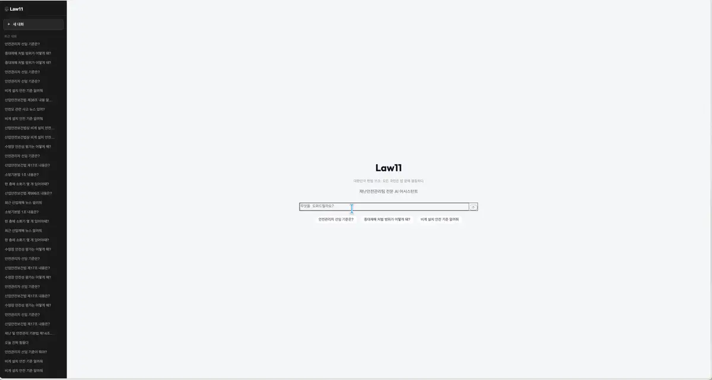
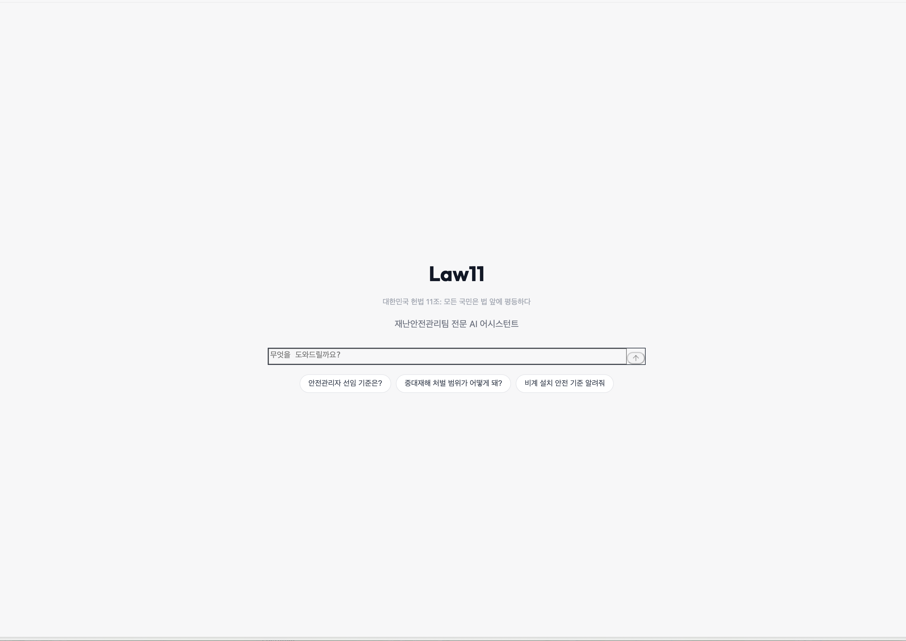
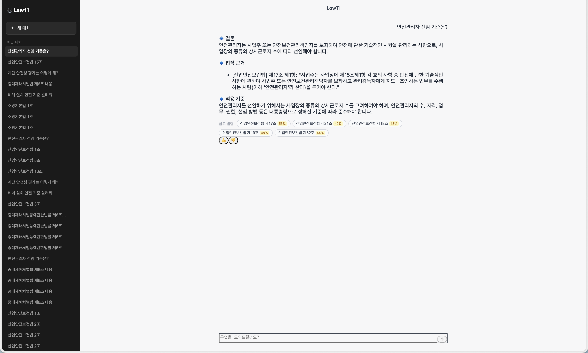
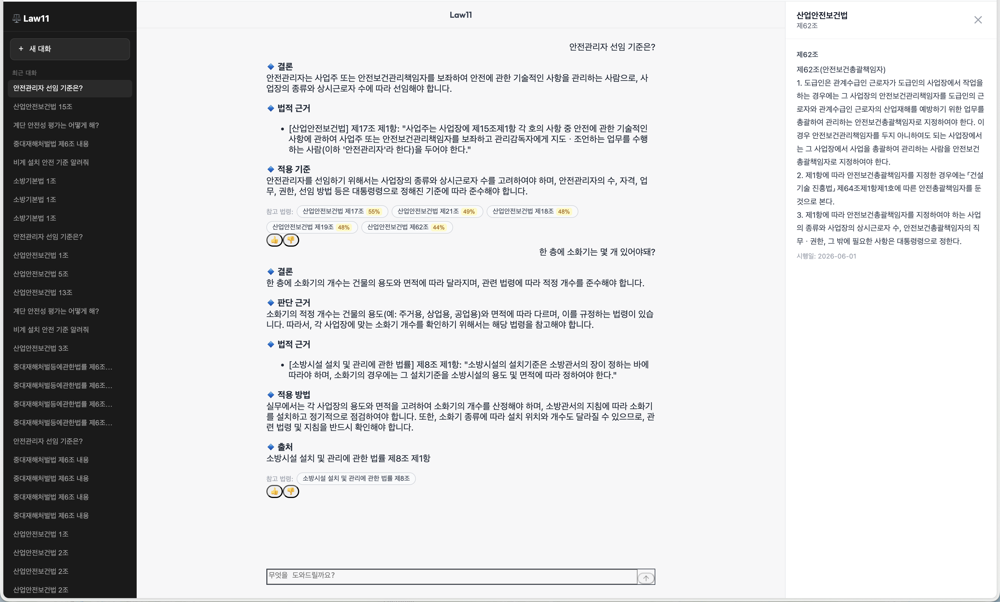
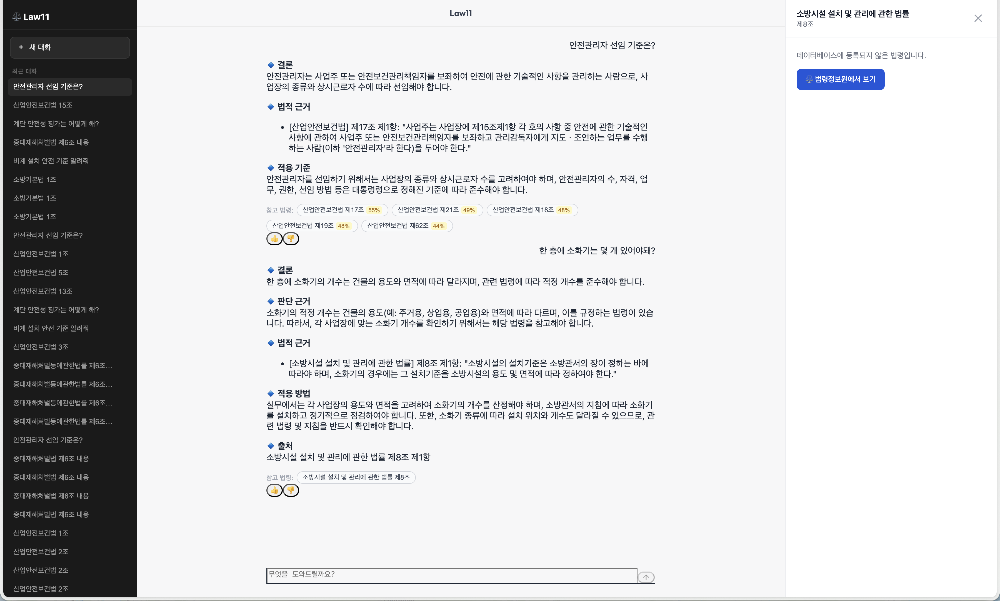
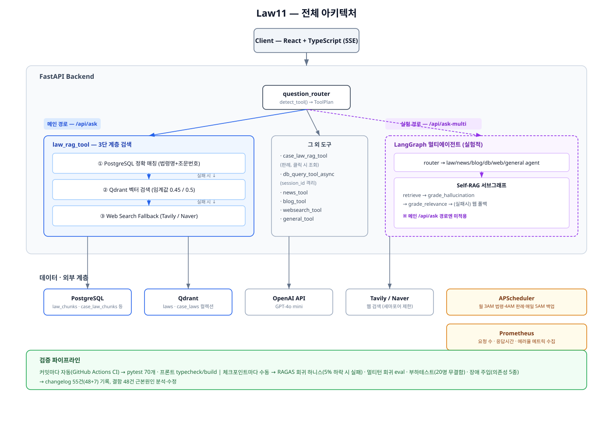

# Law11 — 산업안전보건 법령 RAG 챗봇

**한국어** | [English summary](README.en.md)

[](https://github.com/codingiswine/law11/actions/workflows/ci.yml)
[](https://www.python.org/)
[](https://fastapi.tiangolo.com/)
[](https://reactjs.org/)
[](https://qdrant.tech/)
[](LICENSE)
[]()

> **이 저장소가 보여주는 것**
> 1. 측정하고 고친 기록 — changelog 61건, 전부 실측 검증 포함
> 2. 검증 체계를 직접 만든 것 — 골든셋 30문항, 회귀 하니스, 장애 주입 5종, mutation test
> 3. 표준을 실측으로 기각한 것 — Cross-Encoder Reranking 제거 (Top-1 13.3% → 66.7%)

한국 산업안전보건 법령 9개 (1,629개 조문)를 대상으로 한 **도메인 특화 RAG 시스템**입니다.  
PostgreSQL 정확 매칭 → Qdrant 의미 검색 → GPT-4o-mini 요약의 파이프라인으로 구성되며,  
멀티턴 세션, Citation 추적, SSE 기반 실시간 스트리밍을 지원하며, `/api/ask-multi` 전용 실험적 Self-RAG 할루시네이션 검증 경로도 별도로 제공합니다.

<div align="center">
  
</div>

<table>
  <tr>
    <td></td>
    <td></td>
  </tr>
  <tr>
    <td></td>
    <td></td>
  </tr>
</table>

---

## 목차

- [프로젝트 개요](#프로젝트-개요)
- [시스템 아키텍처](#시스템-아키텍처)
- [RAG 파이프라인 상세](#rag-파이프라인-상세)
- [평가 파이프라인](#평가-파이프라인)
- [발견·수정 이력](#발견수정-이력)
- [클라우드 배포 경험 (AWS EC2)](#클라우드-배포-경험-aws-ec2)
- [트러블슈팅](#트러블슈팅)
- [운영 모니터링](#운영-모니터링)
- [기술 스택](#기술-스택)
- [빠른 시작](#빠른-시작)
- [데이터 현황](#데이터-현황)
- [API 레퍼런스](#api-레퍼런스)
- [개발 환경](#개발-환경)

---

## 프로젝트 개요

### 배경

작년 스타트업 인턴에서 만든 챗봇 프로젝트를 기반으로, 올해 호남권 최대 IT 교육기관 인턴십과 병행해 개인 프로젝트로 RAG 파이프라인을 전면 재설계(question_router 재작성, embedding_cache·self_rag_subgraph 신규 구현)했습니다. Self-RAG 할루시네이션 검증·Citation 추적·답변 품질 점수를 새로 추가했고, 이 과정에서 가지조문(제14조의2 등) 정규화 버그를 발견해 193개 조문을 복구했습니다. Cross-Encoder Reranking도 도입했으나 이후 실측에서 유해함이 확인돼 제거했습니다(#25). 평가 파이프라인에도 할루시네이션·Citation 검증을 확장 적용했습니다.

산업안전보건 실무자들은 9개 법령에 걸쳐 있는 수천 개 조문 중 관련 규정을 빠르게 찾아야 합니다. 기존 법제처 검색은 키워드 일치에 의존해 "안전관리자 선임 기준이 뭔가요?" 같은 자연어 질문에 답하기 어렵습니다.

Law11은 이 도메인에 특화된 RAG 시스템으로, **정확한 조문 번호를 모르는 상황**에서도 의미론적으로 가장 관련 있는 조문을 찾아 GPT가 실무 중심으로 해설합니다.

### 핵심 수치

**검증 · 품질 지표** — 전부 리포지토리의 eval 스크립트로 재현 가능한 실측값입니다 (교정된 골든셋 30케이스 기준, 2026-09-05 재측정):

| 지표 | 수치 | 조건 |
|---|---|---|
| 검색 Top-3 recall | **96.7%** | 골든셋 30케이스 ¹ |
| RAGAS Faithfulness / Answer Relevancy / Context Precision / Context Recall | **0.73~0.74 / 0.57 / 1.00 / 0.92~0.93** | 30케이스, gpt-4o-mini judge, 3회 관측 범위 ² |
| 할루시네이션 | **명백한 날조 0/30** · GROUNDED 28/30 (93.3%) · Citation 누락 0건 | 골든셋 30케이스, DB 수록 9개 법령 범위 내 ³ |
| 라우터 정확도 | **43/43 (100%)** | 키워드 fast-path + LLM 하이브리드, 판례 케이스 11개 포함 ⁴ |
| 멀티턴 회귀 eval | 시나리오 5개 | 전부 mutation test(fix 되돌리기)로 회귀 감지력 검증 |
| 자동화 테스트 / CI | pytest 70개 | GitHub Actions — 백엔드 pytest · 프론트 typecheck/build |
| 동시 접속 부하테스트 | 20명 동시 요청 무실패 | 설계 목표 10명의 2배 |
| 장애 주입 테스트 | 결함 4건 발견·수정 | 의존성 5종(PG·Qdrant·OpenAI·Tavily·Naver) 개별 장애 주입 ⁵ |
| 문서화된 발견-수정 사이클 | changelog 54건 + 체계 도입 이전 7건 | 증상 → 근본 원인 → 실측 검증 형식, [CHANGELOG.md](CHANGELOG.md) |

¹ 복수 인정 조문 정책(#30)과 법령 용어 매핑(#33) 적용 후 값.
² RAGAS 자체의 한국어 인코딩 버그를 근본 수정(#40)한 **이후** 관측값 전부: Faithfulness **0.69 / 0.74** (2026-09-05, 같은 날 2회) · **0.73** (2026-09-19, [결과 파일](law11_backend/eval/results/baseline_20260919_0650_full.json)). 전체 이력: [baseline_history.md](law11_backend/eval/results/baseline_history.md). 같은 날 2회 실행 간 편차(+7.5%, 0.6918→0.7438)가 2주 간격 재측정 편차(−2.0%, 0.7438→0.7289)보다 크다 — LLM-judge 비결정성이 시스템 변화보다 큰 노이즈원이라는 뜻. 이 분산 때문에 회귀 임계는 Faithfulness만 15%, 나머지 5%로 둔다(`eval/harness.py:76,81`). 09-19 판정: F −2.0% / AR +0.1% / CP 0.0% / CR +1.0%, 전부 임계 이내. #40 **이전**(2026-07-19, 인코딩 버그가 살아 있던 상태)의 0.86 / 0.79 / 0.71(#29)은 측정 조건이 달라 위 분포에 합치지 않는다. answer_relevancy는 #39에서 지표 제외했다가 #40에서 복구됨.
³ 나머지 2건은 표현이 뭉개진 PARTIAL. 판정기 자체의 거짓 지적을 #46에서 수정하고, 조작 답변 4종 음성 대조군으로 탐지력 유지를 확인. **DB에 있는 9개 법령 범위 내 결과이며, 범위 밖 질문(웹 폴백 경로)까지 보증하지 않습니다.**
⁴ 판례 라우팅 케이스는 #38에서 추가.
⁵ 상세는 #31.

**시스템 개요**:

| 항목 | 수치 |
|---|---|
| 수록 법령 | 9개 (조문 1,629개) |
| 수록 판례 | 대법원 판례 52건 (6개 법령, 법령당 상한 100건) |
| 임베딩 모델 | `text-embedding-3-large` (3,072차원) |
| 평균 응답 시간 | < 3초 (스트리밍 첫 토큰 기준) |

---

## 시스템 아키텍처

<div align="center">
  
</div>

전체 구성은 위 다이어그램 참고. 메인 경로(`/api/ask`)만 요약하면:

```
질문 → question_router (키워드 fast-path → 애매하면 LLM 분류, DB 세션 컨텍스트 연동) → ToolPlan
     → tool_map: law_rag · case_law_rag · news · blog · websearch · db_query · general
     → law_rag_tool: ① PG 정확 매칭 → ② Qdrant 의미 검색 (top-10, threshold 0.45/0.5) → ③ 웹 폴백
     → GPT-4o-mini 스트리밍 (temperature 0.2) → SSE
        ├─ React 3패널 (사이드바 · 법령 칩 score 배지 · LawSidePanel 조문 원문)
        ├─ citations 테이블 (인용 조문 + 점수)
        └─ QA 로그 (JSONL)
```

> ⚠️ Self-RAG 검증(`self_rag_subgraph.py`: 할루시네이션 판정 → 관련성 판정 → 재시도 최대 2회 → 웹 폴백)은 `/api/ask-multi` 전용 실험 경로이며, 메인 `/api/ask`에는 적용되지 않습니다.

### 서비스 구성 (Docker Compose)

| 서비스 | 이미지 | 포트 | 역할 |
|---|---|---|---|
| `fastapi` | custom build | 8000 | FastAPI 백엔드 |
| `frontend` | Nginx Alpine | 3000 | React 정적 서빙 |
| `postgres` | postgres:15-alpine | 5432 | 조문 원문 + 대화 이력 + Citations |
| `qdrant` | qdrant/qdrant | 6333 | 벡터 유사도 검색 |

### 주요 파일 구조

| 파일 | 역할 |
|---|---|
| `core/plan.py` — `ToolPlan` | 라우터 출력: `tool` 이름 + `args` 딕셔너리 |
| `core/stream.py` — `ToolChunk` | 스트리밍 단위: `type` ∈ `{status,text,source,meta,error}` |
| `app/services/question_router.py` | LLM Hybrid 툴 선택 (키워드 fast-path + LLM fallback + DB 세션 컨텍스트) |
| `app/services/embedding_cache.py` | SQLite 기반 임베딩 캐시 (SHA-256 키) |
| `app/services/rag_grader.py` | 할루시네이션/관련성 판정 함수 (`/api/ask-multi` 전용, 실험적) |
| `app/services/self_rag_subgraph.py` | LangGraph Self-RAG 서브그래프 (4노드 + 2 conditional edge) — `/api/ask-multi` 전용, 실험적 |
| `app/services/langgraph_multi_agent.py` | LangGraph StateGraph 멀티 에이전트 (`/api/ask-multi` 전용, 실험적). 팩토리 함수(`_make_tool_node`)로 5개 tool 노드 생성, 그래프는 모듈 로드 시 1회 컴파일 후 싱글턴 재사용 |
| `app/services/rag_service.py` | eval용 Qdrant 검색 래퍼 + `get_embedding_async` re-export |
| `app/services/law_scheduler.py` | APScheduler — 주간 법령·판례 업데이트 + 일일 chat_history 백업 (job 3개) |
| `app/services/backup_service.py` | `chat_history` JSON 덤프 (최근 30개 보관, #44) |
| `app/services/qa_logger.py` | Retrieval 메타데이터 JSONL 로깅 |
| `app/services/metrics_service.py` | Prometheus 메트릭 수집 |
| `app/api/routes.py` | SSE 엔드포인트, 세션 관리, Citation 저장, 품질 점수 |
| `app/config/settings.py` | 환경변수 로딩(python-dotenv) + 비동기 클라이언트 싱글턴 (OpenAI / Qdrant / SQLAlchemy) |
| `app/tools/law_rag_tool.py` | 3단 검색 + Citation 이벤트 + 웹 fallback 인용 추출 |
| `app/tools/law_updater_async.py` | 법제처 DRF API → PG + Qdrant 동기화 (비동기) |
| `app/tools/case_law_rag_tool.py` | 대법원 판례 RAG — `case_law_chunks` + Qdrant `case_laws` 컬렉션 (#38) |
| `app/tools/case_law_updater_async.py` | 법제처 DRF `target=prec` → 판례 수집·동기화 (#38) |

---

## RAG 파이프라인 상세

### 검색 계층 설계

단순 벡터 검색만으로는 "산업안전보건법 제17조"처럼 정확한 조문을 지정한 질문에서 노이즈가 생깁니다. 반대로 PostgreSQL 정확 매칭만 쓰면 "안전관리자 선임 기준은?" 같은 개념형 질문에서 조문 번호를 알 수 없어 검색이 실패합니다. 두 방식을 계층화해 각 쿼리 유형에 최적의 경로를 사용합니다.

```
질문 유형          경로                                  특징
────────────────────────────────────────────────────────────────
직접 조문 조회   PostgreSQL 정확 매칭 (1ms)              법령명 + 조문번호 인덱스
개념형 질문      Qdrant top-10 → 코사인 상위 5           코사인 유사도 순
외국/국제 법령   Web Search 즉시 분기                    OSHA, ISO 등 키워드 감지
법령 외 질문     Web Search Fallback                     일반 웹 검색
```

### Reranking을 쓰지 않는 이유

초기에는 Qdrant 후보 10개를 `cross-encoder/ms-marco-MiniLM-L-6-v2`로 재순위했지만, 교정된 골든셋 30케이스 실측(`eval/_rerank_experiment.py`)에서 이 영어 전용 모델이 한국어 조문을 사실상 무작위 재배열해 **Top-1 정확도를 66.7% → 13.3%로 파괴**하는 것이 확인돼 제거했습니다. 다국어 CE(`mmarco-mMiniLMv2`)도 순수 벡터 순서를 이기지 못했습니다 (`text-embedding-3-large`가 이미 충분히 강력). 상세는 changelog #25 참고.

### 임베딩 캐시

동일한 질문의 반복 임베딩 생성을 방지하기 위해 SQLite 기반 로컬 캐시를 구현했습니다 (`embedding_cache.py`). 캐시 히트 시 OpenAI API 호출 없이 즉시 반환합니다.

```python
# 캐시 키: SHA-256(query text)
# 저장: .cache/embedding_cache.db (SQLite)
```

### Self-RAG 할루시네이션 검증

> ⚠️ **실험적 기능** — `/api/ask-multi`(LangGraph 멀티 에이전트) 전용이며, 메인 `/api/ask` 경로(law_rag_tool.py)에는 적용되지 않습니다.

`/api/ask-multi` 경로의 답변은 `self_rag_subgraph.py`의 LangGraph 서브그래프를 거쳐 품질을 검증합니다.

```
retrieve() → grade_hallucination() → grade_relevance()
                  ↓ HALLUCINATION           ↓ NOT_RELEVANT
              재시도 (최대 2회)          websearch_fallback()
```

- **GROUNDED**: 답변의 모든 주장이 조문에서 확인 가능 → 그대로 반환
- **PARTIAL/HALLUCINATION**: 재시도 또는 웹 검색 fallback
- **NOT_RELEVANT**: 검색 결과가 질문과 무관 → 웹 검색 fallback

### 멀티턴 세션

프론트엔드가 `session_id`(UUID)를 생성해 매 요청에 포함합니다. 백엔드는 `chat_history` 테이블에서 최근 5개 교환 쌍을 읽어 LLM 프롬프트 앞에 삽입합니다.

```python
# app/services/question_router.py
async def _load_session_context(session_id: str, limit: int = 5) -> str:
    """DB에서 최근 N 교환 쌍을 '사용자: ...\nLaw11: ...' 형식으로 반환"""
```

### Citation 추적

법령 RAG 경로에서 GPT에 전달한 조문의 메타데이터(law_name, article_number, score, rank)를 `citations` 테이블에 저장하고 SSE `source` 이벤트로 클라이언트에 전송합니다. 프론트엔드는 신뢰도 점수 배지가 있는 법령 칩으로 표시합니다.

### 답변 품질 점수

응답이 DB에 저장될 때 자동으로 품질 점수를 산출합니다. 법령명 참조(`「...」`)와 조문 번호(`제N조`) 출현 횟수를 기반으로 0–100점을 계산하며, `chat_history.score` 컬럼에 저장됩니다.

---

## 평가 파이프라인

RAGAS 기반 오프라인 평가 + 라우터·검색·할루시네이션·멀티턴 회귀 eval. 평가 구조, 실행 명령, 베이스라인 이력, 부하 테스트 상세: [docs/eval.md](docs/eval.md)

- **골든셋 30케이스** (`eval/golden_dataset.json`, 13건 오염 교정 후 — #25): 개념형 13 · 기준/설치 10 · 직접 조문 4 · 처벌 3
- **메트릭**: RAGAS 4종 — Faithfulness · Answer Relevancy · Context Precision · Context Recall (judge `gpt-4o-mini`, ragas 0.1.21) + 검색 Top-k · 라우터 정확도 · 할루시네이션/Citation · 멀티턴 시나리오 5개(mutation test 검증)
- **회귀 판정** (`python -m eval.harness --compare`): 직전 baseline 대비 5% 이상 하락 시 exit 1. Faithfulness만 15% — LLM-judge 실행 간 분산이 5%를 넘기 때문 (`eval/harness.py:76,81`)

대표 수치 (2026-09-19 재검증, 결과 파일 `eval/results/baseline_20260919_0650_full.json`):

| 지표 | 값 |
|---|---|
| 검색 Top-3 recall | 96.7% (Top-1 76.7%) |
| RAGAS F / AR / CP / CR | 0.73 / 0.57 / 1.00 / 0.93 — 직전 baseline 대비 전부 임계 이내 |
| 할루시네이션 | 명백한 날조 0/30 · GROUNDED 28/30 · Citation 누락 0 |
| 라우터 정확도 | 43/43 (키워드·LLM 동일) |
| 멀티턴 회귀 | 5/5 |
| 부하 (2026-07-15) | 20명 동시 무실패, Total p50 11.2s |

2026-09-19 재검증: pytest 68 · 라우터 43/43 · Top-3 recall 96.7% · 할루시네이션 0/30 · 멀티턴 5/5 · RAGAS 회귀 없음 — 전 항목 일치. (이후 #51에서 버전 동기화 테스트 2개 추가되어 현재 70개)

```bash
docker compose exec fastapi pip install -r eval/requirements-eval.txt   # ragas는 컨테이너 안에만
docker compose exec fastapi python -m eval.harness --compare            # RAGAS 회귀
docker compose exec fastapi python -m eval.eval_retrieval               # 검색 (무료)
```

---

## 발견·수정 이력

증상 → 근본 원인 → 실측 검증 형식으로 61건을 기록했습니다.
전체 목록: [CHANGELOG.md](CHANGELOG.md)

대표 사례:
- 골든 데이터셋 13건 오염 발견 — 교정하자 Top-3 recall이 46.7% → 40.0%로 오히려 하락, 가짜 성공이 걷힌 결과 (#25)
- 가지조문(제N조의M) 정규화 붕괴로 소실돼 있던 조문 193개 복구 (#28)
- 표준처럼 쓰던 Cross-Encoder Reranking이 유해함을 실측 후 제거 (#25)

---

## 클라우드 배포 경험 (AWS EC2)

로컬 Docker Compose 환경을 AWS EC2(t3.micro, Amazon Linux 2023)에 실제로
배포해본 경험입니다. 단순히 서버를 켜는 것을 넘어, 배포 과정에서 마주친
두 가지 실제 문제를 직접 진단하고 해결했습니다.

### 배포 전 보안 점검

Claude Code로 배포 전 체크리스트를 점검하여, PostgreSQL(5432)과
Qdrant(6333/6334)가 기본 설정상 `0.0.0.0`에 바인딩되어 외부에 노출될
수 있는 문제를 발견했습니다. FastAPI/React는 실제 사용자 접속이
필요하므로 `0.0.0.0`으로 유지하되, DB/Qdrant는 컨테이너 내부 통신만
필요하므로 `127.0.0.1`로 바인딩을 제한하여, AWS 보안그룹 설정을
깜빡하더라도 DB가 원천적으로 외부에 노출되지 않도록 조치했습니다.

### 트러블슈팅 1 — Docker Buildx 누락

`docker compose up -d` 실행 시 `compose build requires buildx 0.17.0
or later` 에러 발생. Docker 엔진은 설치됐지만 이미지 빌드에 필요한
buildx 플러그인이 없었던 것이 원인이었습니다. GitHub Releases API로
최신 버전을 동적으로 조회해 `~/.docker/cli-plugins/`에 직접 설치하여
해결했습니다. (첫 시도에서는 하드코딩한 버전 태그가 존재하지 않아
9바이트짜리 에러 페이지만 다운로드되는 문제를 겪었고, 파일 크기로
다운로드 실패를 판별한 뒤 동적 버전 조회 방식으로 재해결했습니다.)

### 트러블슈팅 2 — crypto.randomUUID Secure Context 에러

배포 후 프론트엔드 접속 시 흰 화면과 함께
`crypto.randomUUID is not a function` 에러 발생. 브라우저 Console
로그를 통해 원인을 특정했습니다 — `crypto.randomUUID`는 브라우저
보안 정책상 HTTPS 또는 localhost에서만 동작하며, IP 주소를 통한
평문 HTTP 접속은 "안전하지 않은 컨텍스트"로 간주되어 API 자체가
차단됩니다. 도메인·인증서 없이도 빠르게 검증하기 위해 SSH 로컬
포트 포워딩(`ssh -L 3000:localhost:3000`)으로 원격 포트를
localhost로 위장시켜 문제를 우회했습니다.

### 배포 스택

- **인프라**: AWS EC2 (t3.micro, Amazon Linux 2023), 보안그룹으로
  인바운드 포트 제한
- **접근 제어**: IAM 사용자 분리, MFA, Budget 알림으로 계정 보안 확보
- **비밀 정보 관리**: `.env` 파일은 git에 포함하지 않고 `scp`로 직접
  전송, Claude Code로 git 히스토리 내 유출 여부 사전 검증

---

## 트러블슈팅

| 증상 | 원인 | 해결 |
|---|---|---|
| 벡터 검색 결과 없음 | Qdrant 데이터 미적재 | `law_updater_async --all` 실행 |
| `DB_PASS` 오류로 시작 실패 | `.env` 파일 누락 | `.env.example` 복사 후 값 입력 |
| SSE 응답 끊김 | Nginx 프록시 버퍼링 | `proxy_buffering off` 설정 확인 |
| 임베딩 캐시 오류 | `.cache/` 권한 문제 | `chmod 777 .cache/` |
| uvicorn 명령어 없음 | pyenv venv 충돌 | `python -m uvicorn` 사용 |

---

## 운영 모니터링

job 시간표, QA 로그 필드, 메트릭 전체 목록, 수동 트리거 명령: [docs/ops.md](docs/ops.md)

- **스케줄러** (`law_scheduler.py`, APScheduler, KST): `weekly_law_update` 월 03:00 법령 동기화 · `weekly_case_law_update` 월 04:00 판례 동기화 · `daily_chat_backup` 매일 05:00 `chat_history` 백업 (최근 30개 보관)
- **Prometheus 메트릭** (`GET /api/metrics`): 요청 수 · 응답 시간 · 토큰 · 에러 · agent 사용량 · 처리 중 요청, 6종
- **QA 로그**: 요청마다 retrieval 메타데이터(tool, selected_source, confidence_score 등)를 `eval/logs/qa_YYYYMMDD.jsonl`에 기록 — `perf_report.py` 입력
- **대시보드**: `GET /api/dashboard` (HTML)

---

## 기술 스택

### Backend

| 기술 | 버전 | 용도 |
|---|---|---|
| FastAPI | 0.115 | 비동기 API 서버, SSE 스트리밍 |
| SQLAlchemy | 2.0 | 비동기 PostgreSQL ORM |
| asyncpg | 0.30 | PostgreSQL 비동기 드라이버 |
| Qdrant Client | 1.11 | 벡터 유사도 검색 |
| LangGraph | 0.2 | Self-RAG 서브그래프 + 멀티 에이전트 |
| LangChain | 0.3 | LLM 체인 유틸 |
| APScheduler | 3.x | 법령 자동 업데이트 스케줄러 |
| RAGAS | 0.1 | RAG 평가 파이프라인 |
| Prometheus Client | - | 운영 메트릭 수집 |

### Frontend

| 기술 | 버전 | 용도 |
|---|---|---|
| React | 19 | UI 컴포넌트 (3패널 레이아웃) |
| TypeScript | 5.9 | 타입 안전성 |
| Vite | 7.1 | 빌드 도구 |
| TailwindCSS | 4.1 | 스타일링 |

**UI 구조:** 좌측 다크 사이드바(대화 히스토리) + 중앙 채팅 + 우측 법령 패널(클릭 시 조문 원문 표시, DB 미등록 법령은 법령정보원 링크)

### Infrastructure

```
Docker Compose  │  Nginx Alpine (프론트엔드 서빙)
PostgreSQL 15   │  Qdrant (벡터 DB)
SQLite          │  임베딩 캐시 (.cache/embedding_cache.db)
```

---

## 빠른 시작

사전 요구사항: Docker 20.10+ / Compose 2.0+, OpenAI API 키

```bash
git clone https://github.com/codingiswine/law11.git
cd law11

# 환경 변수 설정
cp law11_backend/.env.example law11_backend/.env
# law11_backend/.env 편집: OPENAI_API_KEY, DB_PASS 입력

# 빌드 및 실행
docker compose up --build

# 법령 데이터 로드 (최초 1회, 별도 터미널)
docker compose exec fastapi python -m app.tools.law_updater_async --all
```

| 서비스 | URL |
|---|---|
| 프론트엔드 | http://localhost:3000 |
| API 문서 (Swagger) | http://localhost:8000/docs |
| 헬스 체크 | http://localhost:8000/health |

### 환경 변수

필수 3개: `OPENAI_API_KEY` · `DB_PASS` · `LAW_OC_ID`(법제처 DRF OC ID). 선택 변수(`ADMIN_API_KEY`, `LLM_MODEL`, `EMBEDDING_MODEL`, `QDRANT_*`, `CORS_ORIGINS`, `TAVILY_API_KEY`, `NAVER_*`) 전체 표: [CONTRIBUTING.md](CONTRIBUTING.md#환경-변수)

---

## 데이터 현황

### 수록 법령

| 법령명 | 조문 수 |
|---|---|
| 산업안전보건기준에 관한 규칙 | 672 |
| 산업안전보건법 시행규칙 | 246 |
| 산업안전보건법 | 185 |
| 산업안전보건법 시행령 | 124 |
| 재난 및 안전관리 기본법 시행령 | 185 |
| 재난 및 안전관리 기본법 | 147 |
| 재난 및 안전관리 기본법 시행규칙 | 41 |
| 중대재해 처벌 등에 관한 법률 | 16 |
| 중대재해 처벌 등에 관한 법률 시행령 | 13 |
| **합계** | **1,629** (가지조문 소실 복구 후, #28) |

### 법령 자동 업데이트

법제처 DRF(Data Release Format) API를 통해 법령 개정 시 자동으로 PostgreSQL과 Qdrant를 동기화합니다. `law_scheduler.py`가 FastAPI lifespan에 등록되어 **매주 월요일 새벽 3시**에 자동 실행됩니다.

---

## API 레퍼런스

전체 요청/응답 형식과 curl 예시: [docs/api.md](docs/api.md)

| 엔드포인트 | 설명 |
|---|---|
| `POST /api/ask` | 법령 질의 — SSE 스트리밍 (`status` / `text` / `source` / `saved` / `error`) |
| `POST /api/ask-multi` | LangGraph 멀티 에이전트 + Self-RAG (실험적, SSE) |
| `GET` · `DELETE /api/session/{id}` | 세션 대화 이력 조회 · 삭제 |
| `GET /api/law?name=&article=` | 특정 조문 직접 조회 |
| `GET /api/history` · `/api/history/stats` | 전체 대화 이력 · 통계 |
| `POST /api/feedback` | 👍/👎 피드백 |
| `GET /api/metrics` · `/api/metrics/summary` | Prometheus 메트릭 · 요약 |
| `GET /api/dashboard` | 운영 대시보드 (HTML) |
| `POST /api/admin/update-laws` · `/api/admin/backup-chat-history` | 관리자 — `X-Admin-Key` 필요, 키 미설정 시 503 |
| `GET /health` | 헬스 체크 (`settings.APP_VERSION` 반환) |

---

## 개발 환경

로컬 실행(백엔드·프론트), 테스트, Docker 명령어: [CONTRIBUTING.md](CONTRIBUTING.md)

---

## 라이선스

MIT License © 2024 Daniel Shin

---

<div align="center">
  <p>Developer: Daniel Shin · <a href="mailto:codingiswine@gmail.com">codingiswine@gmail.com</a> · <a href="https://github.com/codingiswine">@codingiswine</a> (GitHub)</p>
</div>
